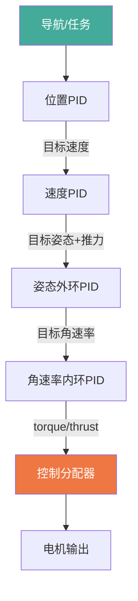
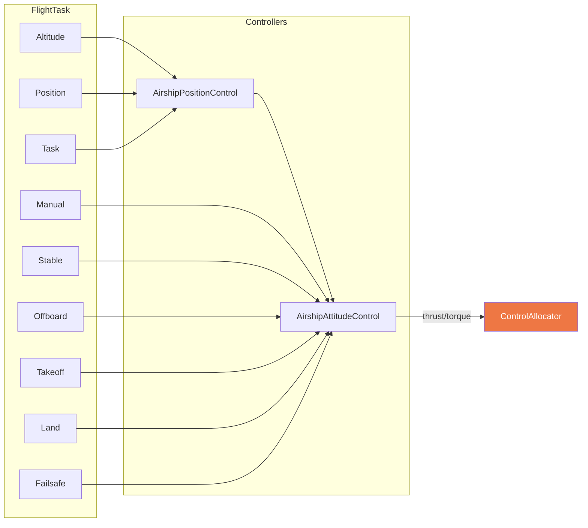
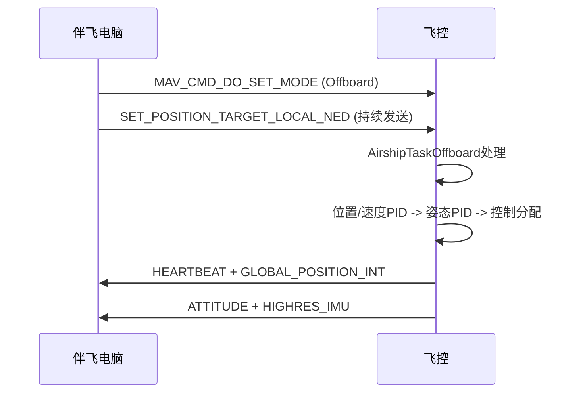

# 灵云01号飞控架构总览

> 本文档面向伴飞电脑(Raspberry Pi 5)开发者，提供飞控系统完整架构概览。

## 1. 系统概述

灵云01号是中性浮力混合升力/推进飞艇，飞控基于 PX4-Autopilot 深度定制，采用 **4自由度级联PID** 控制架构。与传统多旋翼/固定翼有本质区别，开发时必须始终考虑中性浮力特性。

| 项目 | 参数 |
|------|------|
| 起飞重量 | 2206 kg (仿真值) |
| 总体积 | 1800 m3 (氦气) |
| 总长 | 34.7 m |
| 净浮力 | 0 kgf (配重平衡, 悬停推力=0) |
| 转动惯量 | Ixx=44700, Iyy=112200, Izz=145500 kg*m2 |
| 飞控硬件 | 雷迅 x25-evo |
| MAV类型 | MAV_TYPE_AIRSHIP (7) |

## 2. 控制架构 — 4DOF级联PID

### 4个控制自由度

| 控制轴 | 物理含义 | 执行器 | uORB字段 |
|--------|---------|--------|----------|
| Thrust X | 水平前进 | 推进电机4-7同向 | `vehicle_thrust_setpoint.xyz[0]` |
| Thrust Z | 垂直升降 | 升力电机0-3同向 | `vehicle_thrust_setpoint.xyz[2]` |
| Torque Y | 俯仰 | 升力电机前后差动 | `vehicle_torque_setpoint.xyz[1]` |
| Torque Z | 偏航 | 推进电机左右差动 | `vehicle_torque_setpoint.xyz[2]` |

**注意**: Roll轴不可控, 依赖气动自稳定。Torque X 始终为0。

## 3. 核心模块

| 模块 | 路径 | 职责 |
|------|------|------|
| airship_att_control | `src/modules/airship_att_control/` | 4DOF姿态控制器, 参数前缀 AS_ |
| ballast_control | `src/modules/ballast_control/` | 浮力调节与配平 |
| ActuatorEffectivenessCustom | `src/modules/control_allocator/.../ActuatorEffectivenessCustom.cpp` | 4DOF控制分配+推进俯仰耦合补偿 |
| AirshipLandDetector | `src/modules/land_detector/AirshipLandDetector.cpp` | 飞艇着陆检测 |

### airship_att_control 内部结构

## 4. 电机配置

### 升力电机 (0-3): 旋转轴沿Z轴

| 编号 | 名称 | 位置 | 旋转 | 推力方向 | 额定推力 | motorConstant |
|------|------|------|------|---------|---------|---------------|
| M0 | 前1(上升) | (11.225, -2.894, 0.331) | CCW | 向上 | 196N (20kg) | +1.416e-03 |
| M1 | 前2(下降) | (9.215, -2.894, 0.331) | CW | 向下 | 392N (40kg) | -2.832e-03 |
| M2 | 后1(下降) | (-13.535, -2.894, 0.331) | CW | 向下 | 392N (40kg) | -2.832e-03 |
| M3 | 后2(上升) | (-15.525, -2.894, 0.331) | CCW | 向上 | 196N (20kg) | +1.416e-03 |

### 推进电机 (4-7): 旋转轴沿X轴, 推力向前

| 编号 | 名称 | 位置 | 旋转 |
|------|------|------|------|
| M4 | 左前LF | (2.55, +2.39, -1.51) | CCW |
| M5 | 左后LB | (-2.55, +2.39, -1.51) | CW |
| M6 | 右前RF | (2.55, -8.19, -1.51) | CCW |
| M7 | 右后RB | (-2.55, -8.19, -1.51) | CW |

### 关键约束
- 推进电机在重心下方1.5m, 前进推力产生抬头力矩
- Takeoff/Land模式只激活升力电机(0-3), 推进电机(4-7)必须关闭
- 升力电机反扭矩前后对称抵消, 不产生Roll/Yaw
- 推进电机反扭矩前后对称抵消, 差动偏航时不产生Roll

## 5. 伴飞电脑通信接口

| 接口 | 配置 | 用途 |
|------|------|------|
| 以太网 | MAV_2_CONFIG=1000 | Companion Computer主通信 |
| TELEM1 | MAV_1_CONFIG=101, 57600bps | 数传(150km链路) |
| CAN1 | DroneCAN协议 | GPS (CUAV NEO3 Pro) |
| I2C4 | MS4525 | 空速计 (CUAV SKYE2) |

### 伴飞电脑通过MAVLink控制飞艇的关键流程

## 6. 物理特性关键约束

1. **中性浮力**: 悬停推力为零, 不能套用"悬停=有推力"假设
2. **大惯量**: 响应迟缓, PID调参需保守, 偏航5度时气动力矩接近控制力矩极限
3. **无Roll控制**: 不可添加Roll轴控制逻辑
4. **俯仰-推进耦合**: 推进电机转动会产生抬头力矩, 控制分配器自动补偿
5. **失控不坠落**: 断电后缓慢飘移, 失控保护不能简单复用多旋翼策略
