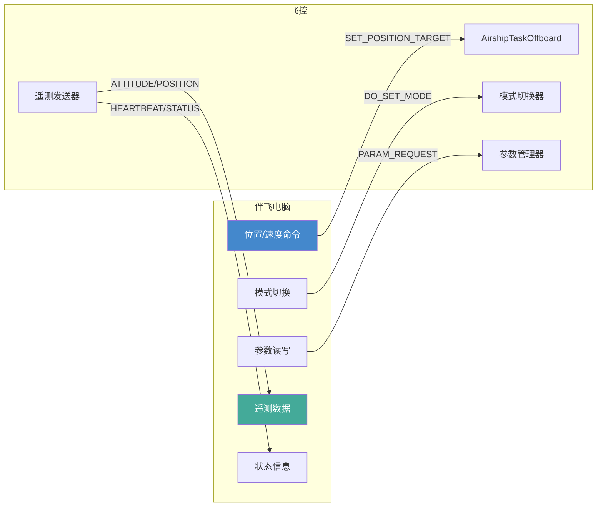

# 灵云01号 MAVLink 通信接口

> 本文档面向伴飞电脑开发者，详细说明飞控MAVLink接口的使用方法。

## 1. 连接配置

### 仿真环境

| 参数 | 值 | 说明 |
|------|-----|------|
| 连接地址 | `udp://:14540` | SITL默认端口 |
| MAVLink版本 | v2 | 推荐使用v2 |
| 系统ID | 1 | 飞控默认 |
| 组件ID | 1 | 飞控默认 |

### 实飞环境

| 接口 | 参数 | 说明 |
|------|------|------|
| 以太网 (MAV_2) | MAV_2_CONFIG=1000 | 伴飞电脑主通道, 默认端口14550 |
| TELEM1 (MAV_1) | MAV_1_CONFIG=101, MAV_1_BAUD=57600 | 数传通道, 57600bps |

**伴飞电脑连接建议**: 使用以太网接口, 带宽远高于串口, 支持高频数据流。

## 2. 飞控 -> 伴飞电脑 (遥测数据)

### 必须订阅的消息

| MAVLink消息 | 频率 | 用途 |
|-------------|------|------|
| HEARTBEAT | 1Hz | 连接状态, 飞行模式, 解锁状态 |
| SYS_STATUS | 1Hz | 系统状态, 电池电压 |
| ATTITUDE | 50Hz | 姿态角 (roll, pitch, yaw) |
| ATTITUDE_QUATERNION | 50Hz | 姿态四元数 |
| LOCAL_POSITION_NED | 30Hz | 本地位置和速度 |
| GLOBAL_POSITION_INT | 10Hz | 全局位置 (经纬度+高度) |
| HIGHRES_IMU | 50Hz | IMU数据 (加速度, 角速度, 气压) |
| EXTENDED_SYS_STATE | 1Hz | 着陆状态, VTOL状态 |
| DISTANCE_SENSOR | 10Hz | 测距仪数据 |

### 关键字段解读

#### HEARTBEAT
```
custom_mode: 飞艇自定义模式编码 (见飞行模式文档)
base_mode: 解锁标志 (MAV_MODE_FLAG_SAFETY_ARMED = 128)
system_status: 系统状态
type: MAV_TYPE_AIRSHIP (7)  -- 飞艇类型标识
```

#### ATTITUDE (NED坐标系, 飞艇特殊注意)
```
pitch: 俯仰角 (正=抬头)
yaw: 偏航角
roll: 横滚角 (不可控, 仅供参考)
time_boot_ms: 时间戳
```

#### LOCAL_POSITION_NED
```
x: 北向位置 (m)
y: 东向位置 (m)
z: 下向位置 (m), 飞艇高度 = -z
vx: 北向速度 (m/s)
vy: 东向速度 (m/s)
vz: 下向速度 (m/s), 飞艇上升速度 = -vz
```

**飞艇特殊性**: 由于中性浮力, 静止悬停时速度接近0, 位置几乎不变, 这与多旋翼悬停时有持续推力完全不同。

## 3. 伴飞电脑 -> 飞控 (控制命令)

### 模式切换

```python
# MAVSDK 示例: 切换到Offboard模式
await drone.action.set_arming_state(ArmingState.ARMED)
await drone.offboard.set_position_ned(PositionNedYaw(0, 0, -20, 0))
await drone.offboard.start()
```

#### 飞艇支持的模式与MAVLink NAV_STATE对应

| AirshipMode | 值 | MAVLink NAV_STATE | 说明 |
|-------------|-----|-------------------|------|
| Manual | 0 | MAV_MODE_PREFLIGHT | 手动控制 |
| Stable | 1 | - | 自稳定(自定义) |
| Altitude | 2 | - | 定高(自定义) |
| Position | 3 | - | 定点(自定义) |
| Offboard | 4 | MAV_MODE_AUTO_OFFBOARD | 外部控制 |
| Takeoff | 5 | MAV_MODE_AUTO_TAKEOFF | 起飞 |
| Land | 6 | MAV_MODE_AUTO_LAND | 降落 |
| Failsafe | 7 | - | 失效保护 |
| Task | 8 | MAV_MODE_AUTO_MISSION | 任务 |

### Offboard控制

Offboard模式是伴飞电脑控制飞艇的主要方式, 需要持续发送控制设定值(>=2Hz)。

#### 方式1: 位置控制 (推荐)

```python
from mavsdk.offboard import PositionNedYaw

# 设定目标位置和偏航
await drone.offboard.set_position_ned(
    PositionNedYaw(north_m=10.0, east_m=5.0, down_m=-30.0, yaw_deg=45.0)
)
```

对应 uORB: `trajectory_setpoint.position + yaw`

#### 方式2: 速度控制

```python
from mavsdk.offboard import VelocityNedYaw

# 设定目标速度和偏航
await drone.offboard.set_velocity_ned(
    VelocityNedYaw(north_m_s=2.0, east_m_s=1.0, down_m_s=-0.5, yaw_deg=0.0)
)
```

对应 uORB: `trajectory_setpoint.velocity + yaw`

#### 方式3: 姿态控制

```python
from mavsdk.offboard import Attitude

# 设定目标姿态和推力
await drone.offboard.set_attitude(
    Attitude(roll_deg=0, pitch_deg=5.0, yaw_deg=90.0, thrust_value=0.3)
)
```

对应 uORB: `vehicle_attitude_setpoint.q_d + thrust_body`

**飞艇Offboard控制约束**:
- `thrust_body[1]`(侧向推力)无效, 飞艇无侧向控制能力
- 推力值含义不同于多旋翼: 0=悬停(中性浮力), 正值=前进/上升
- 偏航控制受限: 推进电机差动偏航能力有限, 大角度转向需S形策略

### 命令发送

```python
# 解锁
await drone.action.arm()

# 上锁
await drone.action.disarm()

# 起飞 (到AS_TAKEOFF_ALT高度)
await drone.action.takeoff()

# 降落
await drone.action.land()

# 返航
await drone.action.return_to_launch()
```

## 4. 参数读写

伴飞电脑可通过MAVLink读写飞控参数:

```python
# 读取参数
param_value = await drone.param.get_float("AS_ALT_P")

# 写入参数
await drone.param.set_float("AS_ALT_P", 0.5)
```

**注意**: 参数修改后需重新解锁才生效(部分参数需重启飞控)。

## 5. 飞艇专属注意事项

### 5.1 着陆状态误判

飞艇悬停静止时, MAVLink会报告 `landed=ON_GROUND`, 这不是错误:
- 飞艇中性浮力, 悬停推力=0
- 着陆检测器认为"推力=0且速度=0"=已着陆
- 这是正确行为, EKF2的ZUPT/ZGUPT正常启用

### 5.2 偏航控制限制

飞艇偏航能力受物理限制:
- 推进电机差动是唯一偏航手段
- Izz=145500 kg*m2, 响应极慢
- 偏航5度时气动力矩接近控制力矩极限
- 大角度转向需采用S形转弯或尾舵策略

### 5.3 高度控制限位

| 参数 | 默认值 | 说明 |
|------|--------|------|
| AS_ALT_MAX | 150m | 高度硬限位(防止超压) |
| AS_ALT_MIN | 2m | 高度低限位(防止撞地) |
| AS_ALT_SOFT | 140m | 软限位预减速起始高度 |

### 5.4 Takeoff模式特殊要求

- 进入条件: ARMED + 高度 < AS_TAKEOFF_ALT(20m)
- 起飞时只激活升力电机, 推进电机关闭
- 到达目标高度保持20秒后自动切换到Altitude模式

## 6. MAVLink数据流示意


