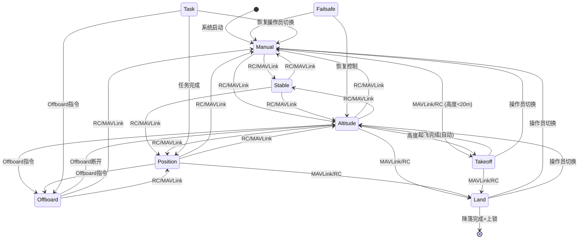
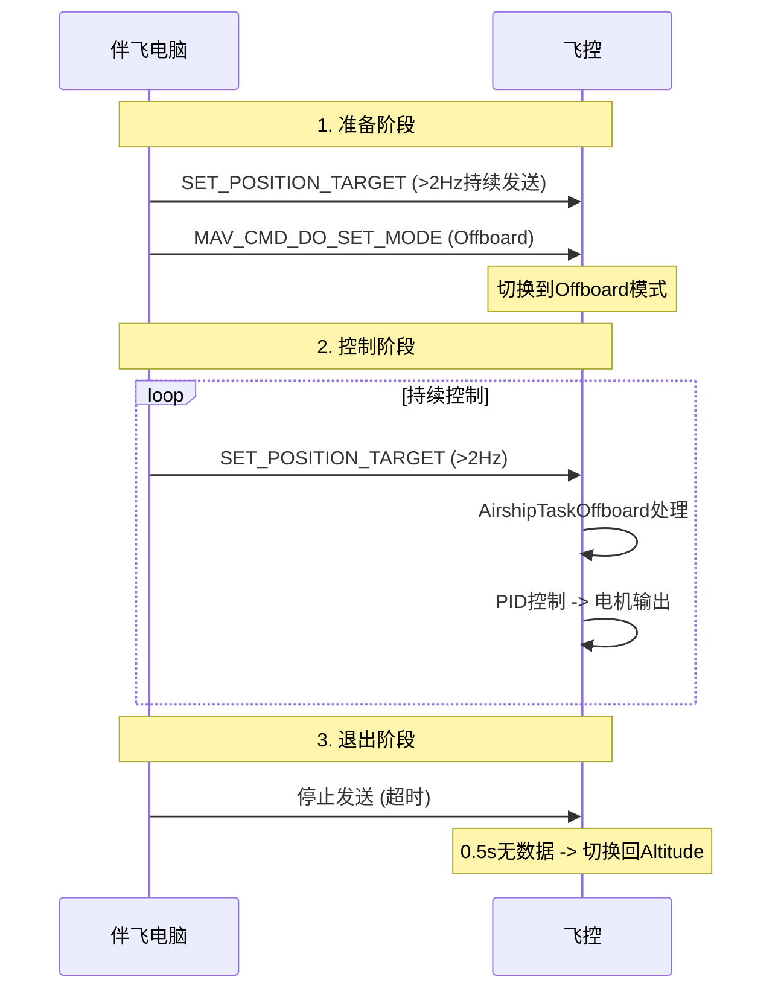
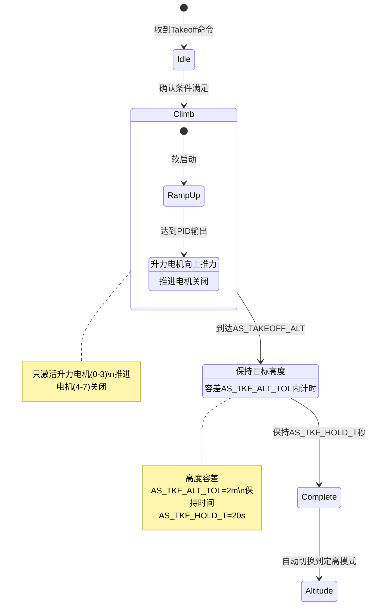
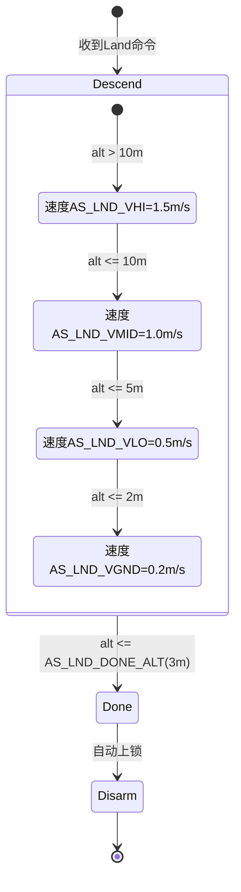

# 灵云01号 飞行模式与状态机

> 本文档面向伴飞电脑开发者，详细说明飞艇的飞行模式、切换条件和状态机逻辑。

## 1. 飞行模式总览

| 模式 | 编号 | 推进电机 | 升力电机 | 自动控制 | 典型用途 |
|------|------|---------|---------|---------|---------|
| Manual | 0 | 开启 | 开启 | 无 | 手动飞行 |
| Stable | 1 | 开启 | 开启 | 姿态稳定 | 辅助手动 |
| Altitude | 2 | 开启 | 开启 | 高度+姿态 | 定高悬停 |
| Position | 3 | 开启 | 开启 | 位置+高度+姿态 | 定点悬停 |
| Offboard | 4 | 开启 | 开启 | 外部控制 | 伴飞电脑控制 |
| Takeoff | 5 | 关闭 | 开启 | 全自动起飞 | 自动起飞 |
| Land | 6 | 关闭 | 开启 | 全自动降落 | 自动降落 |
| Failsafe | 7 | 开启 | 开启 | 失效保护 | 紧急保护 |
| Task | 8 | 开启 | 开启 | 任务执行 | 自主任务 |

## 2. 模式切换状态机



## 3. 各模式详细说明

### 3.1 Manual (手动模式)

- 操纵杆直接映射为推力和姿态命令
- 无自动控制, 完全依赖操作员
- 操纵映射: Throttle->前进推力, Pitch杆->高度, Roll杆->偏航速率, Yaw杆->俯仰速率

### 3.2 Stable (自稳定模式)

- 自动保持当前姿态(俯仰角+偏航角)
- 无外部控制, 释放操纵杆后自动保持
- 适合新手操作

### 3.3 Altitude (定高模式)

- 高度PID自动保持目标高度
- 速度PID控制水平移动
- Pitch杆调整高度目标, Throttle杆控制前进速度
- 悬停推力=0(中性浮力)

### 3.4 Position (定点模式)

- 位置PID->速度PID->推力/姿态 完整闭环
- 自动保持当前位置和高度
- 操纵杆调整位置目标
- **推荐自动悬停模式**

### 3.5 Offboard (外部控制)

- 接收伴飞电脑发送的 `trajectory_setpoint` 或 `vehicle_attitude_setpoint`
- 需持续发送(>=2Hz), 否则超时退出
- 超时后自动切换回 Altitude 模式
- 伴飞电脑控制飞艇的主要模式



### 3.6 Takeoff (起飞模式)

**进入条件**:
1. 已解锁 (ARMED)
2. 当前高度 < AS_TAKEOFF_ALT (默认20m)
3. 收到Takeoff命令

**起飞流程**:



**退出条件**:
- 自动起飞: 到达目标高度 + 保持20秒 -> 自动切换到Altitude模式
- 手动退出: 操作员切换到其他模式
- 条件不满足: 高度已超过AS_TAKEOFF_ALT时拒绝进入

### 3.7 Land (降落模式)

**降落流程**:



**关键约束**:
- 只激活升力电机(0-3), 推进电机(4-7)关闭
- 分阶段下降速度, 接地时极慢(0.2m/s)
- 降落完成判断仅使用高度(alt_agl <= AS_LND_DONE_ALT), 不依赖landed状态

### 3.8 Failsafe (失效保护)

**触发条件**:
- RC信号丢失
- 数据链丢失 (COM_DL_LOSS_T=30s)
- Offboard控制超时

**行为**:
- 记录失效前的模式
- 飞艇中性浮力, 不会坠落
- 尝试恢复到安全模式(Altitude)
- 数据链丢失时执行返航(NAV_DLL_ACT=3)

**注意**: 飞艇失效保护逻辑不能简单复用多旋翼的"降落"策略, 因为飞艇断电后缓慢飘移而非坠落。

### 3.9 Task (任务模式)

- 执行预设任务 (导航、避障等)
- 通过MAVLink MISSION_ITEM上传任务
- 任务完成后自动切换到Position模式

## 4. 伴飞电脑控制流程建议

### 4.1 标准起飞+Offboard控制流程

```python
import asyncio
from mavsdk import System
from mavsdk.offboard import PositionNedYaw

async def standard_flight():
    drone = System()
    await drone.connect(system_address="udp://:14540")

    # 1. 解锁
    print("-- Arming")
    await drone.action.arm()

    # 2. 自动起飞到20m
    print("-- Takeoff")
    await drone.action.takeoff()
    await asyncio.sleep(30)  # 等待起飞完成

    # 3. 切换到Offboard
    print("-- Starting Offboard")
    await drone.offboard.set_position_ned(PositionNedYaw(0, 0, -20, 0))
    await drone.offboard.start()

    # 4. 执行任务
    await drone.offboard.set_position_ned(PositionNedYaw(50, 30, -30, 45))
    await asyncio.sleep(20)

    # 5. 退出Offboard
    print("-- Stopping Offboard")
    await drone.offboard.stop()

    # 6. 降落
    print("-- Landing")
    await drone.action.land()
    await asyncio.sleep(60)

    # 7. 上锁
    await drone.action.disarm()

asyncio.run(standard_flight())
```

### 4.2 紧急处理

| 紧急情况 | 推荐操作 | MAVLink命令 |
|---------|---------|-------------|
| 偏离航线 | 切换到Position模式 | MAV_CMD_DO_SET_MODE |
| 失去控制 | 切换到Stable模式 | MAV_CMD_DO_SET_MODE |
| 需要紧急降落 | 切换到Land模式 | MAV_CMD_NAV_LAND |
| 偏航失控 | 停止前进, 逐步修正 | 降低速度后小角度修正 |
| 高度过高 | 切换Altitude模式 | MAV_CMD_DO_SET_MODE |

**飞艇紧急特性**: 飞艇中性浮力, 即使完全断电也不会坠落, 只会随风力缓慢飘移。
