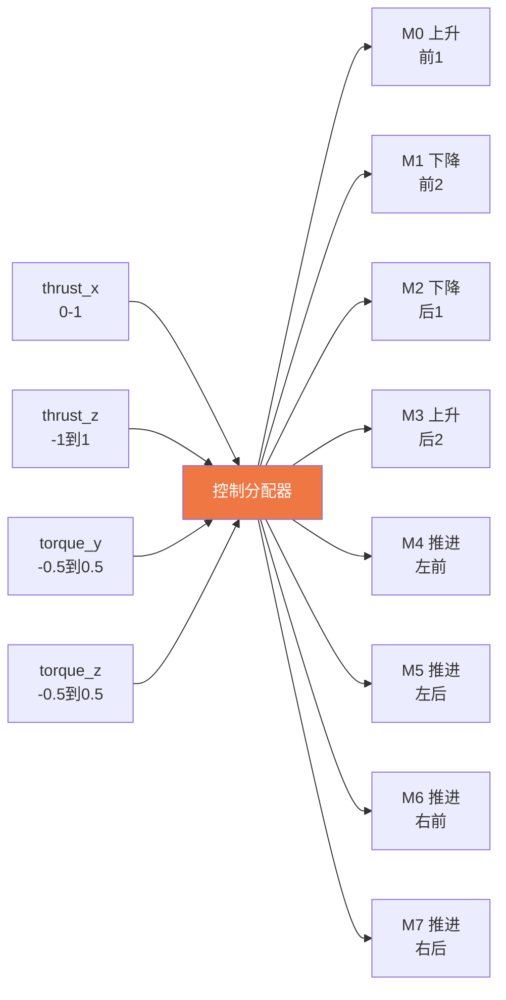
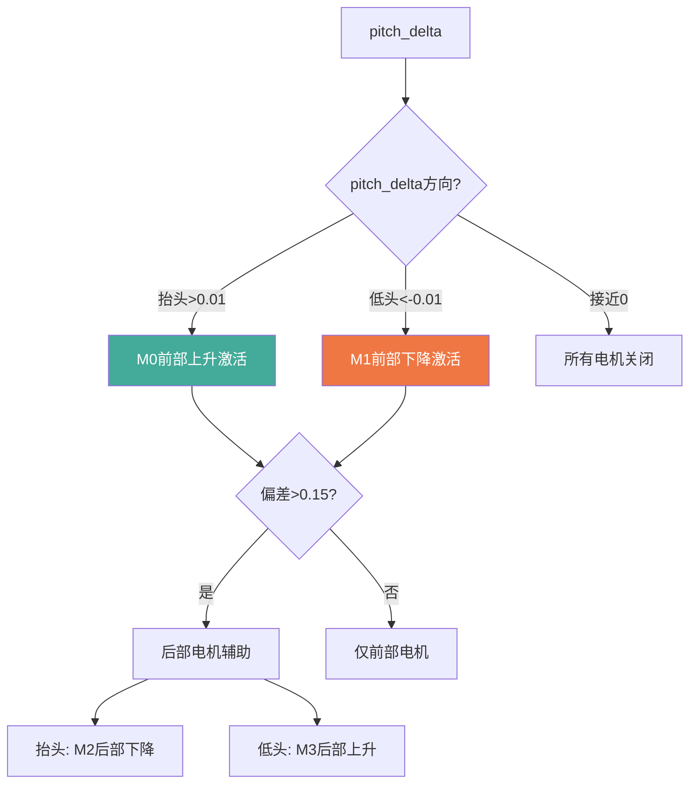

# 灵云01号 控制分配器与电机映射

> 本文档面向伴飞电脑开发者，详细说明4DOF控制分配逻辑和推进-俯仰耦合补偿。

## 1. 控制分配器概览

控制分配器 (`ActuatorEffectivenessCustom`) 将飞控输出的归一化控制量 (thrust_x, thrust_z, torque_y, torque_z) 映射到8个电机的实际输出。



## 2. 推进电机分配 (M4-M7)

### 2.1 基础分配

```
left_prop  = forward + yaw_diff    (M4, M5)
right_prop = forward - yaw_diff    (M6, M7)
```

- `forward`: 水平前进推力 [0, 1]
- `yaw_diff`: 偏航差动量, 独立限制在 [-0.5, 0.5]

### 2.2 起飞/悬停模式检测

```
if thrust_x < 0.01:
    # 起飞/悬停模式: 推进电机完全关闭
    forward = 0
else:
    # 正常模式: 推进电机工作
```

**约束**: Takeoff/Land模式下, 推进电机(4-7)必须关闭, 即使需要偏航控制也不能启动。

### 2.3 偏航差动

```
yaw_diff = torque_z * 0.8
yaw_diff = constrain(yaw_diff, -0.5, 0.5)  # 独立限制

# 差动不能超过forward (防止一侧电机变负)
if forward > 0.05:
    yaw_diff = constrain(yaw_diff, -forward, forward)
```

当一侧电机关闭(yaw_diff = forward)时偏航力矩最大, 但前进速度受限。

### 2.4 偏航最小功率

当需要偏航但forward很低时, 提升forward到最小值:
```
if forward < 0.05 and |torque_z| > 0.01:
    min_fwd = |torque_z| * 0.5 / 0.7
    forward = max(0.1, min_fwd)
```

## 3. 升力电机分配 (M0-M3)

### 3.1 基础推力分配

```
if thrust_z < -0.01:
    # 上升: 激活M0(前1上升) + M3(后2上升)
    base_up = -thrust_z
elif thrust_z > 0.01:
    # 下降: 激活M1(前2下降) + M2(后1下降)
    base_down = thrust_z
```

### 3.2 俯仰差动

FRD坐标系: `torque_y > 0` = 抬头(机头上抬)

| 模式 | 抬头策略 | 低头策略 |
|------|---------|---------|
| 上升 | M0增加, M3减少 | M0减少, M3增加 |
| 下降 | M1减少, M2增加 | M1增加, M2减少 |
| 悬停 | M0(上升)+M2(下降) | M1(下降)+M3(上升) |

### 3.3 悬停模式 — 前部电机优先方案

悬停模式(base_up和base_down都接近0)采用前部电机优先策略:



**策略优点**:
- M1最大低头力矩 = 392N * 10.232m = 4011 N*m (是M0的2倍)
- 推进抬头力矩(forward=0.3) = 393 N*m << M1低头力矩
- 节省后部电机能耗

### 3.4 推进-俯仰耦合补偿

推进电机在重心下方1.5m, 向前推力产生抬头力矩:
```
T_pitch_prop = PZ_PROP * F_prop_actual  (N*m)
```

补偿策略: 用M1(前部下降)+M3(后部上升)产生低头力矩, 保持净推力=0:
```
comp_m1 = T_pitch_prop / (K_LIFT_DOWN * PX_ARM_TOTAL)
comp_m3 = comp_m1 * K_LIFT_DOWN / K_LIFT_UP  (= 2 * comp_m1)
```

| forward | 推进抬头力矩 | comp_m1 | comp_m3 | 总低头力矩 |
|---------|------------|---------|---------|----------|
| 0.1 | 44 N*m | 0.005 | 0.009 | 44 N*m |
| 0.3 | 393 N*m | 0.04 | 0.08 | 393 N*m |
| 0.5 | 1091 N*m | 0.11 | 0.22 | 1091 N*m |
| 1.0 | 4366 N*m | 0.45 | 0.90 | 4366 N*m |

**物理常数** (来自参数):
- K_LIFT_UP (CA_AS_K_LUP) = 196 N/norm2
- K_LIFT_DOWN (CA_AS_K_LDN) = 392 N/norm2
- K_PROP (CA_AS_K_PROP) = 726.3 N/norm2
- PZ_PROP (CA_AS_PZ_PROP) = 1.503 m
- PX_FRONT (CA_AS_PX_FRONT) = 10.232 m
- PX_REAR (CA_AS_PX_REAR) = 14.518 m

## 4. 电机输出范围

所有电机输出归一化到 [0, 1]:
- 0 = 完全关闭
- 1 = 最大输出

**注意**: 飞艇不支持电机反转, 所以输出不能为负值。当yaw_diff > forward时, 一侧电机只能降到0。

## 5. 伴飞电脑对控制分配的理解

伴飞电脑不需要直接控制电机, 只需理解控制量含义:

| 控制量 | 范围 | 物理含义 |
|--------|------|---------|
| thrust_x | [0, 1] | 前进推力(0=悬停, 1=全速) |
| thrust_z | [-1, 1] | 升降推力(负=上升, 正=下降) |
| torque_y | [-0.5, 0.5] | 俯仰力矩(正=抬头) |
| torque_z | [-0.5, 0.5] | 偏航力矩(正=右转) |

**偏航力矩限制** (AS_YAW_TMAX=0.5): 推进电机差动产生的偏航力矩受物理限制, 大惯量(Izz=145500)导致偏航响应极慢。偏航5度时气动力矩接近控制力矩极限, 不可能快速转向。
