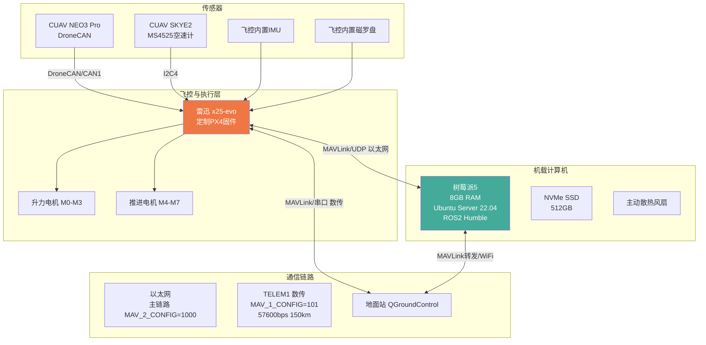
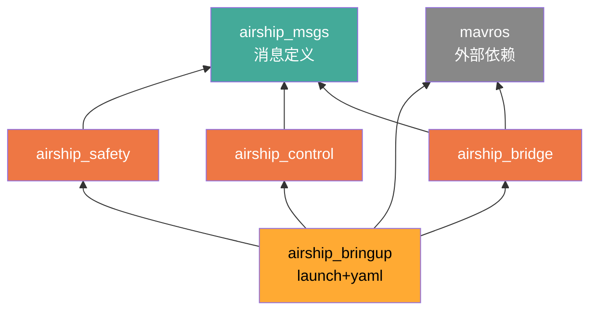
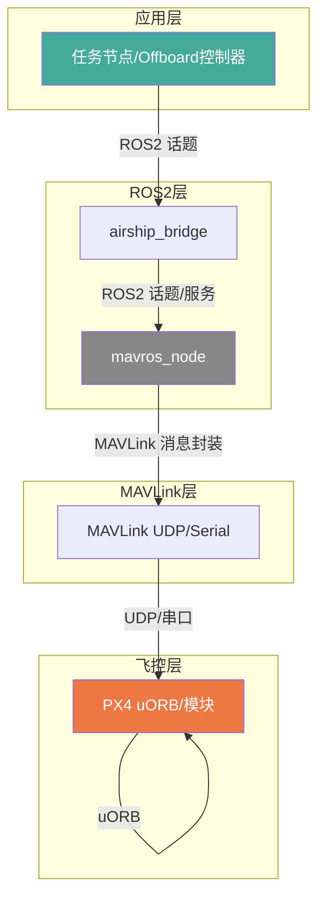
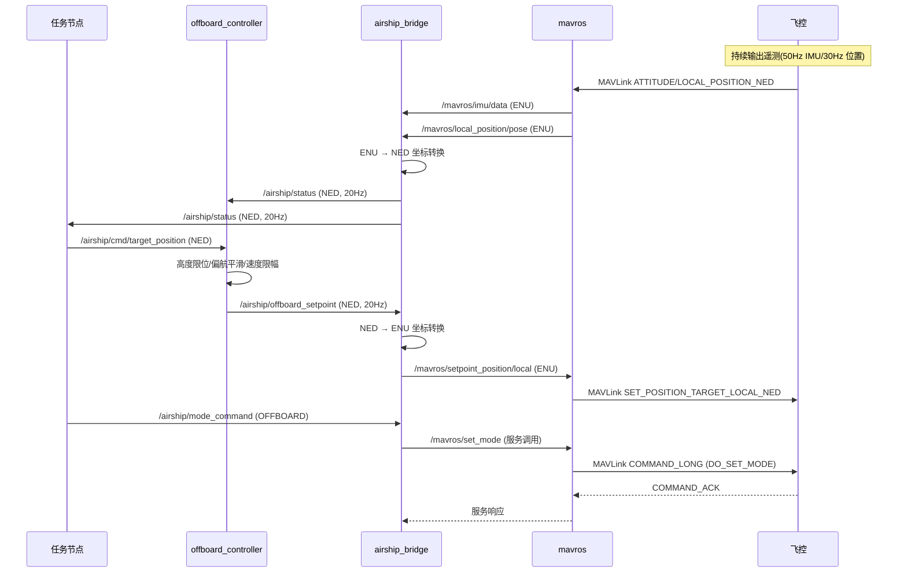
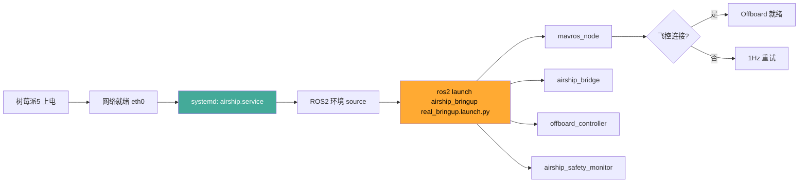

# 树莓派5机载计算机(伴飞电脑)架构

> 本文档描述灵云01号飞艇机载计算机(Companion Computer)基于 **树莓派5 + Ubuntu Server 22.04 + ROS2 Humble** 的完整架构。
> 机载计算机不直接驱动电机，而是通过 MAVLink/MAVROS 与定制 PX4 飞控(雷迅 x25-evo)协作，承担高层任务规划、安全监控、Offboard 控制、链路冗余等职责。

## 1. 系统概述

机载计算机作为飞艇的"大脑中枢"，向上对接地面站/云端，向下对接飞控。其核心定位是：

| 职责 | 说明 |
|------|------|
| 高层控制 | Offboard 位置/速度控制，将任务级目标转换为 MAVLink 设定值 |
| 状态聚合 | 将分散的 MAVLink 遥测聚合为统一的 `AirshipStatus` 话题 |
| 安全监控 | 高度/偏航/俯仰/链路/电池的多维度安全守护，可自动降级 |
| 模式管理 | 解锁/起飞/降落/模式切换等高层指令的封装与转发 |
| 任务扩展 | 预留任务节点接口(`/airship/cmd/*`)，支持自主航点、视觉、避障等扩展 |
| 链路冗余 | 通过以太网主链路 + 数传备份链路，保证飞控通信可靠 |

机载计算机**不直接**操纵电机或读取 IMU，所有底层控制由 PX4 飞控完成。机载计算机断电后，飞控仍能独立维持安全模式(Failsafe/Land)。

## 2. 硬件架构

### 2.1 硬件拓扑



### 2.2 树莓派5硬件配置

| 项目 | 选型 | 说明 |
|------|------|------|
| SoC | BCM2712 (Cortex-A76 4核 2.4GHz) | 满足 ROS2 多节点并发需求 |
| 内存 | 8GB LPDDR4X | 推荐 8GB，最低 4GB |
| 存储 | 512GB NVMe SSD (PCIe Gen3) | 高于 SD 卡，提升日志与构建性能 |
| 网络 | 千兆以太网 + WiFi6 | 以太网接飞控，WiFi 调试/备份链路 |
| 操作系统 | Ubuntu Server 22.04 LTS (64-bit) | 与 ROS2 Humble 官方匹配 |
| 供电 | 5V/5A USB-C PD | 需飞控 BEC 稳压输出，避免掉电重启 |
| 散热 | 主动散热风扇 + 散热片 | 高温会触发 CPU 降频，影响实时性 |
| GPIO | 仅作监控用(状态指示灯) | 不直接驱动执行器，与飞控隔离 |

### 2.3 与飞控的物理连接

| 接口 | 树莓派5端 | 飞控端 | 用途 |
|------|----------|--------|------|
| 以太网 | eth0 | ETH (MAV_2_CONFIG=1000) | **主链路**：MAVLink/UDP，飞控IP=192.168.1.10 |
| 串口 | UART0/ttyAMA0 | TELEM1 (MAV_1_CONFIG=101) | 备用链路：MAVLink 57600bps |
| CAN | 不直接接 | CAN1 (DroneCAN) | 飞控侧接 GPS，机载计算机不参与 |
| I2C | 不直接接 | I2C4 (MS4525) | 飞控侧接空速计，机载计算机不参与 |
| 电源 | USB-C 5V/5A | BEC 5V输出 | **禁止** USB 数据线同时连飞控 |

**关键约束**:
- 机载计算机与飞控之间**仅通过以太网/串口传输 MAVLink**，任何传感器数据不直连
- 以太网链路延迟应 <10ms，丢包率 <1%，否则 Offboard 控制不稳定
- 串口数传链路带宽受限(57600bps)，仅用于关键遥测与紧急指令

## 3. 软件架构 — ROS2 包结构

机载计算机软件采用 **ROS2 Humble** 多包组织，源码位于 [src/](../src/) 目录。

### 3.1 包清单

| 包名 | 类型 | 职责 |
|------|------|------|
| `airship_msgs` | 消息接口包 | 定义 `AirshipStatus` / `OffboardSetpoint` / `ModeCommand` / `SafetyStatus` / `MotorStatus` 五个自定义消息 |
| `airship_bringup` | 启动配置包 | 提供 [real_bringup.launch.py](../src/airship_bringup/launch/real_bringup.launch.py) / [sitl_bringup.launch.py](../src/airship_bringup/launch/sitl_bringup.launch.py) 与 [airship_params.yaml](../src/airship_bringup/config/airship_params.yaml) 参数文件 |
| `airship_bridge` | C++ 节点包 | MAVLink ↔ ROS2 桥接节点 [bridge_node.cpp](../src/airship_bridge/src/bridge_node.cpp) |
| `airship_control` | C++ 节点包 | Offboard 控制器 [offboard_controller.cpp](../src/airship_control/src/offboard_controller.cpp) |
| `airship_safety` | C++ 节点包 | 安全监控节点 [safety_monitor.cpp](../src/airship_safety/src/safety_monitor.cpp) |

### 3.2 依赖关系



### 3.3 节点清单

| 节点名 | 可执行文件 | 包 | 频率 | 语言 |
|--------|-----------|----|------|------|
| `mavros` | `mavros_node` | mavros (外部) | 默认 | C++ |
| `airship_bridge` | `bridge_node` | airship_bridge | 状态20Hz / 设定值20Hz | C++ |
| `offboard_controller` | `offboard_controller` | airship_control | 20Hz | C++ |
| `airship_safety_monitor` | `safety_monitor_node` | airship_safety | 10Hz | C++ |

## 4. 节点架构与话题流

### 4.1 节点拓扑

```mermaid
graph LR
    FC[PX4 飞控] <-->|MAVLink/UDP| MAVROS[mavros_node]

    subgraph MAVROS话题
        State[/mavros/state]
        Pose[/mavros/local_position/pose]
        Vel[/mavros/local_position/velocity_local]
        IMU[/mavros/imu/data]
        GP[/mavros/global_position/global]
        Alt[/mavros/global_position/rel_alt]
        Bat[/mavros/battery]
        ExtState[/mavros/extended_state]
        SpPos[/mavros/setpoint_position/local]
        SpVel[/mavros/setpoint_velocity/cmd_vel]
        SpAtt[/mavros/setpoint_attitude/attitude]
        SrvArm[/mavros/cmd/arming]
        SrvMode[/mavros/set_mode]
        SrvTOL[/mavros/cmd/takeoff land]
    end

    MAVROS --- State & Pose & Vel & IMU & GP & Alt & Bat & ExtState
    MAVROS --- SpPos & SpVel & SpAtt & SrvArm & SrvMode & SrvTOL

    State & Pose & Vel & IMU & GP & Alt & Bat & ExtState --> Bridge[airship_bridge]

    Bridge -->|/airship/status| Status[/airship/status]
    Bridge -->|/airship/mode_command echo| ModeCmd[/airship/mode_command]
    ModeCmd --> Bridge
    Bridge --> SpPos & SpVel & SpAtt
    Bridge --> SrvArm & SrvMode & SrvTOL

    Status --> Safety[airship_safety_monitor]
    Status --> OC[offboard_controller]
    Safety --> OC

    Safety -.->|/airship/safety_override| Bridge
    Safety -->|/airship/safety_status| SafetyStatus[/airship/safety_status]

    CmdPos[/airship/cmd/target_position] --> OC
    CmdVel[/airship/cmd/target_velocity] --> OC
    CmdYaw[/airship/cmd/target_yaw] --> OC

    OC -->|/airship/offboard_setpoint| Bridge

    style FC fill:#e74,color:#fff
    style MAVROS fill:#888,color:#fff
    style Bridge fill:#4a9,color:#fff
    style OC fill:#fa3,color:#000
    style Safety fill:#a4a,color:#fff
```

### 4.2 话题清单

#### 输入话题(机载计算机订阅)

| 话题 | 类型 | 频率 | 来源 | 说明 |
|------|------|------|------|------|
| `/mavros/state` | mavros_msgs/State | 1Hz | mavros | 连接/解锁/模式 |
| `/mavros/extended_state` | mavros_msgs/ExtendedState | 1Hz | mavros | landed_state |
| `/mavros/local_position/pose` | geometry_msgs/PoseStamped | 30Hz | mavros | ENU 本地位置 |
| `/mavros/local_position/velocity_local` | geometry_msgs/TwistStamped | 30Hz | mavros | ENU 本地速度 |
| `/mavros/imu/data` | sensor_msgs/Imu | 50Hz | mavros | ENU 姿态+角速度 |
| `/mavros/global_position/global` | sensor_msgs/NavSatFix | 5Hz | mavros | 经纬度+海拔 |
| `/mavros/global_position/rel_alt` | std_msgs/Float64 | 5Hz | mavros | 相对高度 |
| `/mavros/battery` | sensor_msgs/BatteryState | 1Hz | mavros | 电压/电流/剩余 |
| `/airship/cmd/target_position` | geometry_msgs/PointStamped | 任务节点下发 | 外部任务节点 | NED 目标位置 |
| `/airship/cmd/target_velocity` | geometry_msgs/TwistStamped | 外部 | 外部任务节点 | NED 目标速度 |
| `/airship/cmd/target_yaw` | std_msgs/Float64 | 外部 | 外部任务节点 | NED 目标偏航角 |

#### 输出话题(机载计算机发布)

| 话题 | 类型 | 频率 | 发布者 | 说明 |
|------|------|------|--------|------|
| `/airship/status` | airship_msgs/AirshipStatus | 20Hz | airship_bridge | 聚合后的飞艇综合状态(NED) |
| `/airship/offboard_setpoint` | airship_msgs/OffboardSetpoint | 20Hz | offboard_controller | Offboard 设定值(NED) |
| `/airship/mode_command` | airship_msgs/ModeCommand | 事件 | 外部任务节点 | 模式切换/解锁/起降命令 |
| `/airship/safety_status` | airship_msgs/SafetyStatus | 10Hz | airship_safety_monitor | 安全状态评估 |
| `/airship/safety_override` | airship_msgs/ModeCommand | 事件 | airship_safety_monitor | 安全自动降级指令 |
| `/airship/control/debug` | std_msgs/String | 20Hz | offboard_controller | 调试信息(按需) |

### 4.3 服务接口

| 服务 | 类型 | 客户端 | 服务端 | 用途 |
|------|------|--------|--------|------|
| `/mavros/cmd/arming` | mavros_msgs/CommandBool | airship_bridge | mavros | 解锁/上锁 |
| `/mavros/set_mode` | mavros_msgs/SetMode | airship_bridge | mavros | 飞行模式切换 |
| `/mavros/cmd/takeoff` | mavros_msgs/CommandTOL | airship_bridge | mavros | 起飞指令 |
| `/mavros/cmd/land` | mavros_msgs/CommandTOL | airship_bridge | mavros | 降落指令 |

## 5. 通信架构 — MAVLink / MAVROS

### 5.1 通信分层



### 5.2 飞控连接配置

| 启动方式 | fcu_url | 适用场景 |
|---------|---------|---------|
| 实飞以太网 | `udp://@192.168.1.10` | 树莓派5 → 飞控IP，默认 |
| 实飞串口 | `serial:///dev/ttyAMA0:921600` | 备用链路或无以太网场景 |
| SITL 仿真 | `udp://:14540@localhost:14557` | 本机 PX4 SITL 实例 |

可通过 launch 参数覆盖:
```bash
ros2 launch airship_bringup real_bringup.launch.py fcu_url:=serial:///dev/ttyAMA0:921600
```

### 5.3 关键 MAVLink 消息映射

| MAVLink 消息 | 上行(飞控→机载) | 下行(机载→飞控) | 对应 uORB |
|-------------|----------------|----------------|-----------|
| HEARTBEAT | ✓ 模式/解锁 | — | vehicle_status |
| ATTITUDE | ✓ 姿态四元数 | — | vehicle_attitude |
| LOCAL_POSITION_NED | ✓ 本地位置/速度 | — | vehicle_local_position |
| GLOBAL_POSITION_INT | ✓ 经纬度/相对高度 | — | vehicle_global_position |
| HIGHRES_IMU | ✓ IMU 数据 | — | sensor_imu |
| SYS_STATUS | ✓ 电压/电流 | — | system_power |
| EXTENDED_STATE | ✓ landed_state | — | vehicle_status |
| SET_POSITION_TARGET_LOCAL_NED | — | ✓ Offboard 位置/速度设定 | trajectory_setpoint |
| SET_ATTITUDE_TARGET | — | ✓ Offboard 姿态设定 | vehicle_attitude_setpoint |
| COMMAND_LONG (DO_SET_MODE) | — | ✓ 模式切换 | — |
| COMMAND_LONG (COMPONENT_ARM_DISARM) | — | ✓ 解锁/上锁 | — |
| COMMAND_LONG (NAV_TAKEOFF/NAV_LAND) | — | ✓ 起飞/降落 | — |

## 6. 坐标系与数据流

### 6.1 坐标系约定

| 坐标系 | 使用位置 | X 轴 | Y 轴 | Z 轴 |
|--------|---------|------|------|------|
| **NED** | 飞控内部 / `AirshipStatus` / `OffboardSetpoint` / `/airship/cmd/*` | North | East | Down |
| **ENU** | MAVROS 话题(`/mavros/*`) | East | North | Up |
| Body | 推力/力矩(`thrust_body` / `torque_body`) | 前 | 左(飞艇无) | 上 |

**核心规则**: 机载计算机内部一律采用 **NED** 坐标系，仅在 `airship_bridge` 节点内做 ENU↔NED 转换，对其他节点透明。

### 6.2 数据流时序



### 6.3 ENU↔NED 转换关键代码

详见 [bridge_node.cpp](../src/airship_bridge/src/bridge_node.cpp) 中的 `on_local_pose` / `on_imu` / `timer_setpoint` 实现，转换关系:

| 量 | ENU → NED |
|----|-----------|
| 位置 (x,y,z) | (y, x, -z) |
| 线速度 (vx,vy,vz) | (vy, vx, -vz) |
| 偏航角 yaw | π/2 - yaw_enu |
| 滚转/俯仰 | 不变 |
| 偏航角速度 r | -r_enu |

## 7. 部署架构

### 7.1 启动流程



### 7.2 systemd 服务(推荐)

在 `/etc/systemd/system/airship.service` 配置开机自启:

```ini
[Unit]
Description=Airship ROS2 Companion Stack
After=network-online.target
Wants=network-online.target

[Service]
Type=simple
User=pi
ExecStartPre=/bin/sleep 2
ExecStart=/bin/bash -c "source /opt/ros/humble/setup.bash && \
  source /home/pi/lingyun_ws/install/setup.bash && \
  ros2 launch airship_bringup real_bringup.launch.py"
Restart=on-failure
RestartSec=5
StandardOutput=journal
StandardError=journal

[Install]
WantedBy=multi-user.target
```

启用:
```bash
sudo systemctl daemon-reload
sudo systemctl enable airship.service
sudo systemctl start airship.service
journalctl -u airship.service -f   # 实时查看日志
```

### 7.3 launch 文件设计

[real_bringup.launch.py](../src/airship_bringup/launch/real_bringup.launch.py) 同时启动 4 个节点，参数统一从 [airship_params.yaml](../src/airship_bringup/config/airship_params.yaml) 加载，按节点名分组:

```yaml
airship_bridge:
  ros__parameters:
    status_rate_hz: 20.0
    alt_max_limit: 150.0       # 对应 AS_ALT_MAX
    # ...

offboard_controller:
  ros__parameters:
    control_rate_hz: 20.0
    yaw_rate_limit: 0.524      # 对应 AS_YAW_RMAX
    # ...

airship_safety_monitor:
  ros__parameters:
    alt_max_hard: 150.0
    battery_critical_voltage: 20.0
    # ...
```

**注意**: 参数键名必须与 `declare_parameter` 中的默认值一致，且节点名与 YAML 顶层分组名严格对应。

## 8. 开发与构建环境

### 8.1 工作空间布局

```
~/lingyun_ws/
├── src/
│   └── LINGYUN-CoPilot/        # 本仓库(clone)
│       ├── src/                # ROS2 包源码
│       │   ├── airship_msgs/
│       │   ├── airship_bridge/
│       │   ├── airship_control/
│       │   ├── airship_safety/
│       │   └── airship_bringup/
│       └── docs/               # 开发文档
├── build/                      # colcon 中间产物
├── install/                    # colcon 安装产物(source 用)
└── log/                        # colcon 构建日志
```

### 8.2 依赖安装

```bash
# ROS2 Humble 基础(假设已按官方文档安装)
sudo apt update
sudo apt install -y \
  ros-humble-mavros \
  ros-humble-mavros-extras \
  ros-humble-mavros-msgs \
  ros-humble-geographic-msgs \
  python3-colcon-common-extensions

# MAVROS geographiclib 数据集(首次必须)
sudo /opt/ros/humble/lib/mavros/install_geographiclib_datasets.sh

# 编译工具链
sudo apt install -y \
  build-essential \
  cmake \
  ninja-build
```

### 8.3 构建与测试

```bash
cd ~/lingyun_ws

# 全量构建
colcon build --symlink-install --cmake-args -DCMAKE_BUILD_TYPE=Release

# 增量构建(仅修改 airship_control)
colcon build --packages-select airship_control --symlink-install

# Source 环境(每个新终端)
source install/setup.bash

# SITL 仿真验证(本机需先启动 PX4 SITL)
ros2 launch airship_bringup sitl_bringup.launch.py

# 实飞启动
ros2 launch airship_bringup real_bringup.launch.py
```

### 8.4 调试工具

| 工具 | 用途 | 示例 |
|------|------|------|
| `ros2 topic list` | 查看话题 | `ros2 topic list` |
| `ros2 topic echo` | 查看话题数据 | `ros2 topic echo /airship/status` |
| `ros2 topic hz` | 检查频率 | `ros2 topic hz /mavros/imu/data` |
| `rqt_graph` | 节点关系图 | `rqt_graph` |
| `rqt_plot` | 实时曲线 | `rqt_plot /airship/status/altitude_relative` |
| `ros2 param list` | 查看参数 | `ros2 param list /airship_bridge` |
| `ros2 service call` | 调用服务 | `ros2 service call /mavros/cmd/arming mavros_msgs/srv/CommandBool "{value: true}"` |

## 9. 性能与资源约束

### 9.1 实时性预算

| 链路 | 目标延迟 | 上限 | 备注 |
|------|---------|------|------|
| 飞控 → 机载(状态) | <50ms | 100ms | IMU 50Hz, 位置 30Hz |
| 机载 → 飞控(设定值) | <50ms | 100ms | Offboard 需 ≥2Hz, 否则飞控退出 Offboard |
| 任务节点 → offboard_controller | <100ms | 200ms | 任务级指令 |
| 安全检测周期 | 100ms | 200ms | `airship_safety_monitor` 10Hz |

### 9.2 资源占用参考(树莓派5 8GB)

| 节点 | CPU | 内存 | 说明 |
|------|-----|------|------|
| mavros_node | ~15% | ~80MB | 主要消耗在 MAVLink 解析 |
| airship_bridge | ~3% | ~20MB | 轻量级话题转发 |
| offboard_controller | ~2% | ~15MB | 简单 PID/限幅 |
| airship_safety_monitor | ~1% | ~15MB | 周期检查 |
| 合计 | ~21% | ~130MB | 余量充足，可扩展任务节点 |

### 9.3 可靠性要求

| 项目 | 要求 | 实现方式 |
|------|------|---------|
| Offboard 心跳 | ≥2Hz | `airship_bridge::timer_setpoint` 20Hz 定时发布 |
| 链路丢失检测 | 3s 告警 / 10s 紧急 | `airship_safety_monitor` 双阈值 |
| 飞控断连保护 | Failsafe 自动接管 | 飞控侧配置，机载计算机不参与 |
| 进程崩溃 | 自动重启 | systemd `Restart=on-failure` |
| CPU 过热 | <80°C | 主动散热 + `vcgencmd measure_temp` 监控 |

### 9.4 已知约束

1. **MAVROS 单点**: mavros_node 崩溃则所有 MAVLink 通信中断，飞控将进入 Offboard 失效 Failsafe
2. **以太网单链路**: 主链路故障需切换数传，但数传带宽不足(57600bps)无法承载 Offboard 设定值流
3. **无 Roll 控制**: 机载计算机不能发送 Roll 设定值，`thrust_body[1]` 必须为 0
4. **偏航能力受限**: 大角度转向必须用 S 形分段策略，单次偏航变化率受 `AS_YAW_RMAX=0.524 rad/s` 限制
5. **高度硬限位**: `[2m, 150m]` 由飞控强制执行，机载计算机的软限位(140m)仅作为预警

## 10. 扩展节点接入规范

新增任务节点(如航点执行、视觉定位、避障)应遵循以下规范:

### 10.1 输入订阅

```cpp
// 订阅统一状态(NED)
sub_status_ = create_subscription<airship_msgs::msg::AirshipStatus>(
    "/airship/status", rclcpp::QoS(10),
    [this](const airship_msgs::msg::AirshipStatus::SharedPtr msg) { /* ... */ });

// 订阅安全状态(可选, 用于判断是否允许下发指令)
sub_safety_ = create_subscription<airship_msgs::msg::SafetyStatus>(
    "/airship/safety_status", rclcpp::QoS(10),
    [this](const airship_msgs::msg::SafetyStatus::SharedPtr msg) { /* ... */ });
```

### 10.2 输出发布

```cpp
// 发布目标位置(NED, z 向下为正, 高度=-z)
pub_target_pos_ = create_publisher<geometry_msgs::msg::PointStamped>(
    "/airship/cmd/target_position", rclcpp::QoS(10));

// 发布目标偏航(NED, rad)
pub_target_yaw_ = create_publisher<std_msgs::msg::Float64>(
    "/airship/cmd/target_yaw", rclcpp::QoS(10));

// 发布模式切换命令
pub_mode_cmd_ = create_publisher<airship_msgs::msg::ModeCommand>(
    "/airship/mode_command", rclcpp::QoS(10));
```

### 10.3 强制约束

1. **不得直接调用 `/mavros/*` 服务或话题**: 所有 MAVLink 交互必须经 `airship_bridge` 中转，保证坐标系一致与安全审计
2. **不得绕过 `airship_safety_monitor`**: 在 `safety_status.safe_to_control == false` 时必须停止下发设定值
3. **目标值必须使用 NED 坐标系**: z 向下为正，高度 = -z
4. **高度限位**: 目标高度必须落在 `[2m, 150m]`，超出将被 `offboard_controller` 限幅
5. **偏航变化率**: 单次目标偏航变化不应超过 30°，大角度转向需分段下发

## 11. 与飞控侧文档的对应关系

| 本文档章节 | 对应飞控文档 |
|-----------|-------------|
| §2 硬件架构 | [01_飞控架构总览](./01_飞控架构总览.md) §5 通信接口 |
| §4 节点话题 | [02_uORB消息接口](./02_uORB消息接口.md) |
| §5 MAVLink 通信 | [03_MAVLink通信接口](./03_MAVLink通信接口.md) |
| §7.3 参数配置 | [04_参数系统](./04_参数系统.md) |
| §10 模式切换 | [05_飞行模式与状态机](./05_飞行模式与状态机.md) |
| §9.4 电机约束 | [06_控制分配器与电机映射](./06_控制分配器与电机映射.md) |

## 12. 版本信息

- **生成日期**: 2026-07-20
- **机载计算机**: Raspberry Pi 5 (8GB) + Ubuntu Server 22.04 LTS
- **ROS2 版本**: Humble Hawksbill (LTS)
- **MAVROS 版本**: ros-humble-mavros (最新)
- **飞控固件**: 基于 PX4 v1.17.0 (灵云01号定制)
- **目标硬件**: 树莓派5 + 雷迅 x25-evo 飞控板
