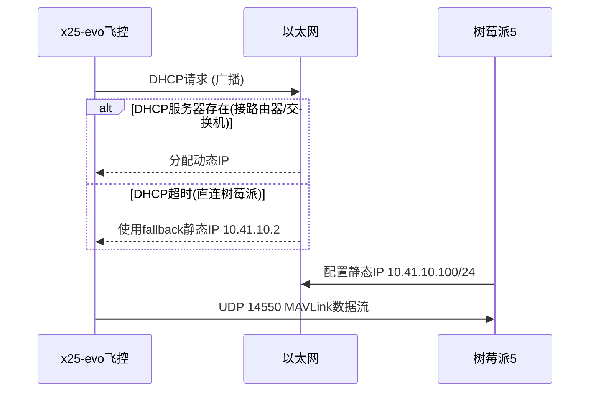
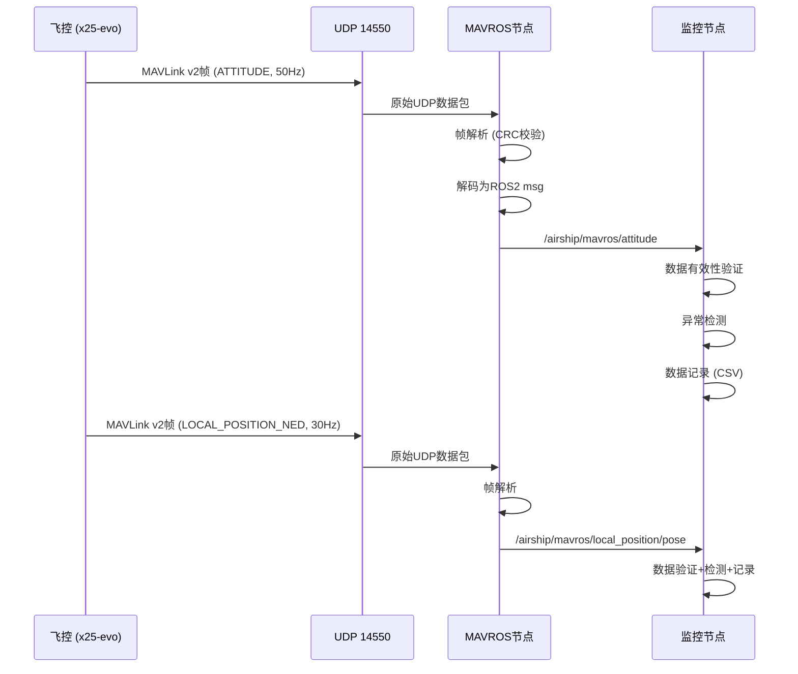

# 灵云01号 树莓派机载计算机 — 飞控参数实时监控协议对接文档

> 本文档面向树莓派5 AI IDE 开发工具，规定飞控参数实时监控系统与飞控之间的完整协议对接规范。

---

## 修订记录

| 版本 | 日期 | 修改内容 | 作者 |
|------|------|---------|------|
| V1.0 | 2026-07-09 | 初稿 | 灵云团队 |
| V1.1 | 2026-08-19 | 补充 PMU2 Lite 电池监控协议（1.4.8）、网络配置细化（1.2） | 灵云团队 |
| V1.2 | 2026-08-19 | 新增真实电机转速/电机遥测/EKF/GPS 高频推送配置（rc.board_extras）、频率分配更新 | 灵云团队 |

---

## 目录

1. [数据采集规范](#1-数据采集规范)
2. [数据解析标准](#2-数据解析标准)
3. [异常检测与告警协议](#3-异常检测与告警协议)
4. [数据存储规范](#4-数据存储规范)
5. [资源优化指南](#5-资源优化指南)
6. [接口测试要求](#6-接口测试要求)

---

## 1. 数据采集规范

### 1.1 通信接口

| 项目 | 规范 |
|------|------|
| 物理接口 | x25-evo ETH 端口 (RJ45, 100Mbps) |
| 传输协议 | UDP (MAVLink v2) |
| 中间件 | ROS2 Humble + MAVROS |
| 连接方式 | 直连或交换机 |
| 飞控IP | 默认 `10.41.10.2` (DHCP/fallback) |
| 树莓派IP | 建议 `10.41.10.100` (同网段) |
| 端口 | 飞控 UDP 14550 -> 树莓派 UDP 14550 |

### 1.2 飞控端网络配置

#### 1.2.1 网络段

飞控以太网口采用 **`10.41.10.0/24`** 网段（子网掩码 `255.255.255.0`）：

| 项目 | 值 | 说明 |
|------|-----|------|
| 网络段 | `10.41.10.0/24` | 255.255.255.0 |
| 飞控IP | `10.41.10.2` | 静态fallback地址 |
| 树莓派推荐IP | `10.41.10.100` | 同网段，不冲突即可 |
| 默认网关 | `10.41.10.254` | 默认路由 |
| DNS | `10.41.10.254` | DNS服务器 |

#### 1.2.2 IP获取方式：`fallback` 模式

飞控以太网 IP 配置存储在 microSD 卡的 **`/fs/microsd/net.cfg`** 文件中，**不是固化在固件代码里**。默认采用 `fallback` 模式：

1. 先尝试 DHCP 自动获取 IP
2. 如果 DHCP 超时（如直连树莓派无路由器），回退到静态 IP `10.41.10.2`

**net.cfg 文件内容**（通过 QGC 的 MAVLink 控制台写入 SD 卡）：

```bash
DEVICE=eth0
BOOTPROTO=fallback
IPADDR=10.41.10.2
NETMASK=255.255.255.0
ROUTER=10.41.10.254
DNS=10.41.10.254
```

**DHCP/fallback 工作流程**：



**修改飞控IP**：通过 QGC 的 MAVLink 控制台执行：

```bash
echo DEVICE=eth0 > /fs/microsd/net.cfg
echo BOOTPROTO=fallback >> /fs/microsd/net.cfg
echo IPADDR=10.41.10.2 >> /fs/microsd/net.cfg
echo NETMASK=255.255.255.0 >> /fs/microsd/net.cfg
echo ROUTER=10.41.10.254 >> /fs/microsd/net.cfg
echo DNS=10.41.10.254 >> /fs/microsd/net.cfg
```

写完后重启飞控生效。

#### 1.2.3 树莓派端IP配置

**直连场景**（无路由器）：

```bash
# 树莓派设置静态IP
sudo ip addr add 10.41.10.100/24 dev eth0
sudo ip link set eth0 up

# 测试连通性
ping 10.41.10.2
```

**自动配置**（编辑 `/etc/dhcpcd.conf`）：

```bash
interface eth0
static ip_address=10.41.10.100/24
static routers=10.41.10.254
```

#### 1.2.4 MAVLink 通道参数

MAVLink 以太网通道参数已通过 `rc.board_defaults` 固化：

| 参数 | 值 | 说明 |
|------|-----|------|
| MAV_2_CONFIG | 1000 | 以太网 MAVLink |
| MAV_2_BROADCAST | 1 | 启用广播 |
| MAV_2_UDP_PRT | 14550 | UDP 端口 |
| MAV_2_REMOTE_PRT | 14550 | 远程端口 |
| MAV_2_RATE | 100000 | 速率限制 100kbps |
| MAV_2_MODE | 0 | Custom 模式 |

### 1.3 树莓派端 MAVROS 启动配置

**启动命令**：

```bash
# ROS2 Humble + MAVROS
ros2 launch mavros px4.launch.py \
  fcu_url:="udp://:14550@10.41.10.2:14550" \
  gcs_url:="" \
  tgt_system:=1 \
  tgt_component:=1
```

**启动脚本** `/home/pi/airship_monitor/start_mavros.sh`：

```bash
#!/bin/bash
source /opt/ros/humble/setup.bash
source /home/pi/airship_monitor/install/setup.bash

# 启动 MAVROS 节点
ros2 launch mavros px4.launch.py \
  fcu_url:="udp://:14550@10.41.10.2:14550" \
  tgt_system:=1 \
  tgt_component:=1 \
  namespace:=/airship

echo "MAVROS started, monitoring airship flight controller..."
```

**ROS2 工作空间结构**：

```
/home/pi/airship_monitor/
  ├── src/
  │   ├── airship_monitor/          # 监控节点包
  │   │   ├── airship_monitor/
  │   │   │   ├── __init__.py
  │   │   │   ├── monitor_node.py   # 主监控节点
  │   │   │   ├── anomaly_detector.py # 异常检测器
  │   │   │   ├── data_logger.py    # 数据记录器
  │   │   │   └── alert_manager.py  # 告警管理器
  │   │   ├── config/
  │   │   │   ├── thresholds.yaml   # 安全阈值配置
  │   │   │   └── logger_config.yaml# 日志配置
  │   │   ├── launch/
  │   │   │   └── monitor.launch.py
  │   │   ├── package.xml
  │   │   └── setup.py
  │   └── CMakeLists.txt -> symlink
  ├── logs/                         # 数据日志目录
  └── start_mavros.sh
```

### 1.4 核心采集参数定义

#### 1.4.1 姿态与角速度 (50Hz)

| 参数名 | MAVROS Topic | 类型 | 单位 | 精度 | 说明 |
|--------|-------------|------|------|------|------|
| roll | `/airship/mavros/attitude/roll` | float32 | deg | 0.1 | 横滚角(主动控制, 上升电机左右差动) |
| pitch | `/airship/mavros/attitude/pitch` | float32 | deg | 0.1 | 俯仰角, 正=抬头 |
| yaw | `/airship/mavros/attitude/yaw` | float32 | deg | 0.1 | 偏航角 |
| rollspeed | `/airship/mavros/attitude/rollspeed` | float32 | rad/s | 0.01 | 横滚角速率 |
| pitchspeed | `/airship/mavros/attitude/pitchspeed` | float32 | rad/s | 0.01 | 俯仰角速率 |
| yawspeed | `/airship/mavros/attitude/yawspeed` | float32 | rad/s | 0.01 | 偏航角速率 |

**MAVLink 源消息**: `ATTITUDE` (ID=30)

#### 1.4.2 位置与速度 (30Hz)

| 参数名 | MAVROS Topic | 类型 | 单位 | 精度 | 说明 |
|--------|-------------|------|------|------|------|
| x | `/airship/mavros/local_position/pose/pose/position/x` | float64 | m | 0.01 | 北向位置 (NED) |
| y | `/airship/mavros/local_position/pose/pose/position/y` | float64 | m | 0.01 | 东向位置 (NED) |
| z | `/airship/mavros/local_position/pose/pose/position/z` | float64 | m | 0.01 | 下向位置, 高度=-z |
| vx | `/airship/mavros/local_position/velocity/velocity/twist/linear/x` | float64 | m/s | 0.01 | 北向速度 |
| vy | `/airship/mavros/local_position/velocity/velocity/twist/linear/y` | float64 | m/s | 0.01 | 东向速度 |
| vz | `/airship/mavros/local_position/velocity/velocity/twist/linear/z` | float64 | m/s | 0.01 | 下向速度, 上升=-vz |
| alt_agl | `/airship/mavros/altitude/altitude/amsl` | float32 | m | 0.1 | 海拔高度 (近似AGL) |

**MAVLink 源消息**: `LOCAL_POSITION_NED` (ID=32), `GLOBAL_POSITION_INT` (ID=33)

#### 1.4.3 全局位置 (10Hz)

| 参数名 | MAVROS Topic | 类型 | 单位 | 精度 |
|--------|-------------|------|------|------|
| lat | `/airship/mavros/global_position/global/latitude` | float64 | deg | 1e-6 |
| lon | `/airship/mavros/global_position/global/longitude` | float64 | deg | 1e-6 |
| alt | `/airship/mavros/global_position/global/altitude` | float64 | m | 0.1 |
| heading | `/airship/mavros/global_position/compass_hdg` | float32 | deg | 0.1 |
| alt_relative | `/airship/mavros/global_position/rel_alt` | float32 | m | 0.1 |

**MAVLink 源消息**: `GLOBAL_POSITION_INT` (ID=33)

#### 1.4.4 系统状态 (1Hz)

| 参数名 | MAVROS Topic | 类型 | 说明 |
|--------|-------------|------|------|
| arming_state | `/airship/mavros/state/armed` | bool | 解锁状态 |
| mode | `/airship/mavros/state/mode` | string | 当前飞行模式 |
| system_status | `/airship/mavros/state/system_status` | uint8 | 系统状态码 |
| landed_state | `/airship/mavros/extended_state/landed_state` | uint8 | 着陆状态 |

**MAVLink 源消息**: `HEARTBEAT` (ID=0), `EXTENDED_SYS_STATE` (ID=245)

#### 1.4.5 电池状态 (1Hz)

| 参数名 | MAVROS Topic | 类型 | 单位 | 精度 |
|--------|-------------|------|------|------|
| voltage | `/airship/mavros/battery/voltage` | float32 | V | 0.1 |
| current | `/airship/mavros/battery/current` | float32 | A | 0.1 |
| remaining | `/airship/mavros/battery/remaining` | float32 | % | 1 |

**MAVLink 源消息**: `SYS_STATUS` (ID=1), `BATTERY_STATUS` (ID=147)

**硬件来源**: CUAV PMU2 Lite 电源模块（DroneCAN/CAN 回传电池数据）。详见 [1.4.8 PMU2 Lite 电池监控协议](#148-pmu2-lite-电池监控附录注)，该模块同时为飞控提供 15V/6A 供电。

#### 1.4.6 电机输出 (10Hz)

| 参数名 | MAVROS Topic | 类型 | 说明 |
|--------|-------------|------|------|
| actuator_outputs | `/airship/mavros/actuator_control/outputs` | float32[10] | 10个电机归一化输出[0,1] |

**电机映射**:

| 索引 | 电机 | 类型 | 方向 |
|------|------|------|------|
| 0 | M0 左前 | 上升 | A10 222.5N |
| 1 | M1 右前 | 上升 | A10 222.5N |
| 2 | M2 左后 | 上升 | A10 222.5N |
| 3 | M3 右后 | 上升 | A10 222.5N |
| 4 | M4 前 | 下降 | A10 222.5N |
| 5 | M5 后 | 下降 | A10 222.5N |
| 6 | M6 左前 | 推进 | P65M 1352.4N |
| 7 | M7 右前 | 推进 | P65M 1352.4N |
| 8 | M8 左后 | 推进 | P65M 1352.4N |
| 9 | M9 右后 | 推进 | P65M 1352.4N |

**MAVLink 源消息**: `ACTUATOR_OUTPUT_STATUS` (ID=380)

#### 1.4.7 空速 (10Hz)

| 参数名 | MAVROS Topic | 类型 | 单位 | 精度 |
|--------|-------------|------|------|------|
| airspeed | `/airship/mavros/airspeed/indicated_speed` | float32 | m/s | 0.1 |
| true_airspeed | `/airship/mavros/airspeed/true_speed` | float32 | m/s | 0.1 |

**MAVLink 源消息**: `VFR_HUD` (ID=74)

#### 1.4.8 PMU2 Lite 电池监控协议（DroneCAN 电源模块）

**硬件来源**：CUAV PMU2 Lite 电源管理模块，通过飞控 POWER C1/C2 排线接入，同时负责给 x25-evo 供电 + 电池数据回传。

**PMU2 Lite 电气规格**:

| 参数 | 规格 | 说明 |
|------|------|------|
| 输出电压 | **15V / 6A** | 供飞控（非16V） |
| 输入电压 | 20V ~ 70V（15V版本） | 48V 锂电池在此范围内，可直接使用 |
| 持续电流 | 130A（良好散热） | 需关注散热 |
| 瞬时电流 | 220A (120s) | |
| 电压精度 | ±0.05V | |
| 电流精度 | ±0.1A | |
| 通信协议 | **CAN（DroneCAN/UAVCAN）** | 标准协议，非专有 |
| 处理器 | STM32H5 Cortex-M33 250MHz | 运行 M4C 架构固件 |
| 即插即用 | x25-evo 默认启用 | 无需参数配置 |

**监控参数（经 CAN/DroneCAN 回传）**:

| 参数 | uORB 消息字段 | MAVLink 消息 | MAVROS Topic | 单位 |
|------|--------------|--------------|--------------|------|
| 电池总电压 | `battery_status.voltage_v` | `BATTERY_STATUS`(147) | `/airship/mavros/battery/voltage` | V |
| 电池电流 | `battery_status.current_a` | `BATTERY_STATUS`(147) | `/airship/mavros/battery/current` | A |
| 温度 | `battery_status.temperature` | `BATTERY_STATUS`(147) | `/airship/mavros/battery/temperature` | degC |
| 电量百分比(SOC) | `battery_status.remaining` | `BATTERY_STATUS`(147) | `/airship/mavros/battery/remaining` | % |

> **重要限制**：PMU2 Lite 仅测量**总电压和总电流**，**不能检测单节电芯电压**。电芯级监控需另配带 BMS 通信的智能电池。

> **数据流向**：CAN/DroneCAN → PX4 `src/drivers/uavcan/`（BatteryInfo 消息）→ `battery_status` uORB → PX4 发布 `BATTERY_STATUS` MAVLink → MAVROS 转发到 `/airship/mavros/battery`。

**接线方式**：

```
48V锂电池 ──→ PMU2 Lite BATT-IN（7AWG/QS8粗线）
                 │
                 ├── BATT-OUT ──→ 电调/电机（测试阶段可不接）
                 │
                 └── 排线(MOLEX) ──→ x25-evo POWER C1/C2
                                        ├── 15V → 飞控供电
                                        └── CAN → 电池数据回传
```

**CAN 总线节点分配建议**：

| CAN 总线 | 挂载设备 | 说明 |
|---------|---------|------|
| CAN1 | NEO3 Pro GPS + PMU2 Lite | GPS 与电源模块共用，节点ID区分 |
| CAN2 | 8个电调(若用DroneCAN电调) | 独立总线，避免电调高频数据干扰电源/GPS |

> 若 PMU2 Lite 与 GPS 都接 CAN1，注意两端各接 120Ω 终端电阻；未来电调走 DroneCAN 时建议挂 CAN2 分离。

#### 1.4.9 GPS 原始数据 (5Hz)

由 `rc.board_extras` 显式推送至以太网口。

| 参数名 | MAVLink 源消息 | MAVROS Topic | 类型 | 单位 | 精度 |
|--------|----------------|--------------|------|------|------|
| satellites_visible | `GPS_RAW_INT` (24) | `/airship/mavros/global_position/raw/gps_fix_type` | int8 | 颗 | 1 |
| fix_type | `GPS_RAW_INT` (24) | 同上 | uint8 | 等级 | 1 |
| eph (水平精度) | `GPS_RAW_INT` (24) | 同上 | uint16 | cm | 1 |
| epv (垂直精度) | `GPS_RAW_INT` (24) | 同上 | uint16 | cm | 1 |

> 卫星数与定位精度用于判断 GPS 锁定质量，飞艇需 GPS 锁定才能解锁（`COM_ARM_WO_GPS=0`）。

#### 1.4.10 EKF 状态/故障标志 (5Hz)

由 `rc.board_extras` 显式推送至以太网口。

| 参数名 | MAVLink 源消息 | MAVROS Topic | 类型 | 说明 |
|--------|----------------|--------------|------|------|
| flags | `ESTIMATOR_STATUS` (230) | `/airship/mavros/estimator_status/status/...` | uint16 | EKF 故障标志位掩码 |
| pos_horiz_accuracy | `ESTIMATOR_STATUS` (230) | 同上 | float32 | 水平位置精度 (m) |
| pos_vert_accuracy | `ESTIMATOR_STATUS` (230) | 同上 | float32 | 垂直位置精度 (m) |
| vel_accuracy | `ESTIMATOR_STATUS` (230) | 同上 | float32 | 速度精度 (m/s) |

**EKF 故障标志位参考**（`estimator_status.flags` 位定义）：

| 位 | 定义 | 含义 |
|----|------|------|
| bit1 | estimator_attitude_valid | 姿态估计有效 |
| bit3 | estimator_velocity_valid | 速度估计有效 |
| bit4 | estimator_pos_horiz_rel_valid | 相对水平位置有效 |
| bit5 | estimator_pos_horiz_abs_valid | 绝对水平位置有效 |
| bit6 | estimator_pos_vert_abs_valid | 绝对垂直位置有效 |
| bit10 | estimator_gps_check_fail | GPS 检查失败 |
| bit12 | estimator_const_pos_mode | 位置锁定模式（GPS 无效） |
| bit14 | estimator_gps_glitch | GPS 信号毛刺 |

> **异常检测要点**：监控 `bit10`(gps_check_fail) 或 `bit12`(const_pos_mode) 可判断 EKF 是否退化到位置锁定，此时飞艇定位精度骤降，应触发警告。

### 1.5 采集频率与时序控制

#### 1.5.1 频率分配

| 优先级 | 数据组 | 飞控发布频率 | 监控采样频率 | 说明 |
|--------|--------|------------|------------|------|
| 最高 | 姿态+角速度 | 50Hz | 50Hz | 响应最快, 异常检测核心 |
| 高 | 位置+速度 | 30Hz | 30Hz | 位置跟踪 |
| 高 | 真实电机转速 (ESC_STATUS) | 10Hz | 10Hz | 经 MAVROS /mavros/esc_status 获取; 需 DroneCAN/CAN 遥测电调, 先搭框架 |
| 中 | 全局位置 | 10Hz | 10Hz | 导航监视 |
| 中 | 电机输出 | 10Hz | 10Hz | 执行器监视 |
| 中 | 空速 | 10Hz | 10Hz | 空速监视 |
| 中 | 电机遥测 (ESC_STATUS) | 5Hz | 5Hz | 转速/电流/电压/温度, 需遥测电调 |
| 中 | 电机信息 (ESC_INFO) | 1Hz | 1Hz | 电机连接/故障标志 |
| 中 | EKF状态 (ESTIMATOR_STATUS) | 5Hz | 5Hz | 状态估计健康/故障标志 |
| 中 | GPS原始 (GPS_RAW_INT) | 5Hz | 5Hz | 卫星数/GPS精度 |
| 低 | 电池+系统状态 | 1Hz | 1Hz | 状态监视 |

> **高频率推送已在 `boards/cuav/x25-evo/init/rc.board_extras` 配置**，通过 `mavlink stream -u 14550 -s <STREAM> -r <HZ>` 显式生效于 MAV_2 以太网口 (本地 UDP 14550)。

#### 1.5.2 时序控制机制

监控节点通过 ROS2 回调机制实现时序控制，无需轮询：

```python
# 示例: 监控节点回调订阅
import rclpy
from rclpy.node import Node
from sensor_msgs.msg import BatteryState
from geometry_msgs.msg import PoseStamped, TwistStamped
from mavros_msgs.msg import State, AttitudeTarget, ActuatorOutputStatus
from mavros_msgs.srv import CommandBool, SetMode

class AirshipMonitorNode(Node):
    def __init__(self):
        super().__init__('airship_monitor')

        # 姿态订阅 (50Hz)
        self.attitude_sub = self.create_subscription(
            PoseStamped, '/airship/mavros/attitude', self.attitude_cb, 10)

        # 位置订阅 (30Hz)
        self.local_pos_sub = self.create_subscription(
            PoseStamped, '/airship/mavros/local_position/pose', self.position_cb, 10)

        # 速度订阅 (30Hz)
        self.velocity_sub = self.create_subscription(
            TwistStamped, '/airship/mavros/local_position/velocity', self.velocity_cb, 10)

        # 状态订阅 (1Hz)
        self.state_sub = self.create_subscription(
            State, '/airship/mavros/state', self.state_cb, 10)

        # 电池订阅 (1Hz)
        self.battery_sub = self.create_subscription(
            BatteryState, '/airship/mavros/battery', self.battery_cb, 10)

        # 电机输出订阅 (10Hz)
        self.actuator_sub = self.create_subscription(
            ActuatorOutputStatus, '/airship/mavros/actuator_control/outputs', self.actuator_cb, 10)

        self.get_logger().info('Airship monitor node started')
```

**关键时序保证**:
- ROS2 回调队列 `qos_history=10` 保证不丢帧
- 监控节点处理时间 < 周期时间 (20ms @ 50Hz)
- 使用 `rclpy` 异步回调，不阻塞主循环
- 异常检测在回调中完成，不额外引入延迟

---

## 2. 数据解析标准

### 2.1 MAVLink 数据帧格式

MAVLink v2 数据帧结构（飞控 -> 监控节点原始数据）：

```c
typedef struct __mavlink_message {
    uint8_t  magic;          // 帧头: 0xFD (MAVLink v2)
    uint8_t  len;            // 负载长度 (0-255)
    uint8_t  incompat_flags; // 不兼容标志
    uint8_t  compat_flags;   // 兼容标志
    uint8_t  seq;            // 序列号
    uint8_t  sysid;          // 系统ID (飞控=1)
    uint8_t  compid;         // 组件ID (飞控=1)
    uint8_t  msgid;          // 消息ID (0-16777215)
    uint8_t  payload[280];   // 消息负载
    uint16_t checksum;       // 校验和 (CRC16-CCITT)
    uint8_t  signature[13];  // 签名 (可选)
} mavlink_message_t;
```

**帧结构示意**：

```
┌──────┬─────┬──────┬─────┬─────┬──────┬───────┬──────┬──────────┬──────────┬───────────┐
│magic │ len │incomp│comp │ seq │sysid │compid │msgid │ payload  │ checksum │ signature │
│0xFD  │     │ flag │flag │     │ 1    │ 1     │      │ (0-280B) │ (2B)     │ (0/13B)   │
├──────┼─────┼──────┼─────┼─────┼──────┼───────┼──────┼──────────┼──────────┼───────────┤
│  1B  │  1B │  1B  │ 1B  │ 1B  │  1B  │  1B   │ 3B   │ 0-280B   │   2B     │   0/13B   │
└──────┴─────┴──────┴─────┴─────┴──────┴───────┴──────┴──────────┴──────────┴───────────┘
```

**MAVROS 负责底层的 MAVLink 帧解析**，监控节点通过 ROS2 topic 直接获取结构化数据，无需手动解析原始帧。

### 2.2 关键消息数据结构

#### 2.2.1 ATTITUDE 消息 (msgid=30) — 姿态数据

```c
// MAVLink 原始定义
typedef struct __mavlink_attitude_t {
    uint32_t time_boot_ms;  // 时间戳 (ms)
    float    roll;          // 横滚角 (rad)
    float    pitch;         // 俯仰角 (rad)
    float    yaw;           // 偏航角 (rad)
    float    rollspeed;     // 横滚角速率 (rad/s)
    float    pitchspeed;    // 俯仰角速率 (rad/s)
    float    yawspeed;      // 偏航角速率 (rad/s)
} mavlink_attitude_t;
```

**ROS2 解析后 topic**: `/airship/mavros/attitude` (geometry_msgs/PoseStamped)

**飞艇特殊性**:
- `roll` 主动控制(4上升电机左右差动), 正常情况下应接近 0
- `pitch` 正常范围 +/- 15 度, 受结构限制
- `yaw` 控制能力受限, 大角度转向困难

#### 2.2.2 LOCAL_POSITION_NED 消息 (msgid=32)

```c
typedef struct __mavlink_local_position_ned_t {
    uint32_t time_boot_ms;  // 时间戳 (ms)
    float    x;             // X 位置 (m, NED 北)
    float    y;             // Y 位置 (m, NED 东)
    float    z;             // Z 位置 (m, NED 下)
    float    vx;            // X 速度 (m/s)
    float    vy;            // Y 速度 (m/s)
    float    vz;            // Z 速度 (m/s)
} mavlink_local_position_ned_t;
```

**高度转换**:
```
altitude_agl = -z   (NED 坐标系下, z 向下为正)
```

#### 2.2.3 SYS_STATUS 消息 (msgid=1)

```c
typedef struct __mavlink_sys_status_t {
    uint32_t onboard_control_sensors_present;
    uint32_t onboard_control_sensors_enabled;
    uint32_t onboard_control_sensors_health;
    uint16_t load;              // CPU 负载 (0.1%)
    uint16_t voltage_battery;   // 电池电压 (mV)
    int16_t  current_battery;   // 电池电流 (cA, 10mA)
    uint8_t  battery_remaining; // 剩余电量 (%)
    uint16_t drop_rate_comm;    // 通信丢包率 (0.01%)
    uint16_t errors_comm;
    uint16_t errors_count1;
    uint16_t errors_count2;
    uint16_t errors_count3;
    uint8_t  vendor_id;
    uint8_t  vendor_specific;
} mavlink_sys_status_t;
```

### 2.3 数据有效性判断规则

#### 2.3.1 时间戳有效性

```python
def is_timestamp_valid(msg_timestamp_us, current_us, max_latency_ms=200):
    """检查时间戳是否有效"""
    latency = current_us - msg_timestamp_us
    if latency < 0:
        return False  # 未来时间戳, 无效
    if latency > max_latency_ms * 1000:
        return False  # 超时, 数据过时
    return True
```

#### 2.3.2 数据范围有效性

```python
VALIDATION_RANGES = {
    'roll':       (-180.0, 180.0),    # 度
    'pitch':      (-90.0, 90.0),      # 度
    'yaw':        (-180.0, 180.0),    # 度
    'altitude':   (-100.0, 500.0),    # 米 AGL
    'velocity':   (-30.0, 30.0),      # m/s
    'battery_v':  (0.0, 70.0),        # 伏特
    'battery_pct':(0.0, 100.0),       # %
    'motor_out':  (0.0, 1.0),         # 归一化
    'airspeed':   (0.0, 30.0),        # m/s
}

def validate_data_range(param_name, value):
    """检查数据是否在合理范围内"""
    if param_name not in VALIDATION_RANGES:
        return True  # 未知参数, 跳过
    lo, hi = VALIDATION_RANGES[param_name]
    return lo <= value <= hi
```

#### 2.3.3 连续性检查

```python
def check_continuity(prev_val, curr_val, max_jump, param_name=""):
    """检查数据是否连续(防止跳变/毛刺)"""
    if prev_val is None:
        return True
    jump = abs(curr_val - prev_val)
    if jump > max_jump:
        return False  # 跳变过大, 数据可能异常
    return True
```

**跳变阈值**:

| 参数 | 最大跳变 (每帧) | 说明 |
|------|----------------|------|
| pitch | 2.0 deg | 大惯量, 不可能快速变化 |
| yaw | 2.0 deg | 偏航响应慢 |
| altitude | 1.0 m | 垂直速度限制 |
| vx/vy | 2.0 m/s | 加速度限制 |
| motor_out | 0.3 | 电机响应时间常数 |

#### 2.3.4 数据有效性综合判定

```python
class DataValidator:
    """数据有效性验证器"""

    def __init__(self):
        self.prev_values = {}
        self.consecutive_invalid = {}
        self.MAX_CONSECUTIVE_INVALID = 10  # 连续无效超过10帧, 触发告警

    def validate(self, param_name, value, timestamp_us):
        """综合验证数据有效性"""
        is_valid = True
        reasons = []

        # 1. NaN/Inf 检查
        if math.isnan(value) or math.isinf(value):
            is_valid = False
            reasons.append("NAN_INF")

        # 2. 范围检查
        if not validate_data_range(param_name, value):
            is_valid = False
            reasons.append("OUT_OF_RANGE")

        # 3. 连续性检查
        max_jump = JUMP_THRESHOLDS.get(param_name, float('inf'))
        if not check_continuity(
            self.prev_values.get(param_name), value, max_jump
        ):
            is_valid = False
            reasons.append("JUMP_DETECTED")

        # 4. 更新状态
        self.prev_values[param_name] = value if is_valid else self.prev_values.get(param_name)
        self.consecutive_invalid[param_name] = (
            self.consecutive_invalid.get(param_name, 0) + 1
            if not is_valid else 0
        )

        # 5. 连续无效告警
        if self.consecutive_invalid[param_name] >= self.MAX_CONSECUTIVE_INVALID:
            reasons.append("CONSECUTIVE_FAILURE")
            # 触发告警

        return is_valid, reasons
```

### 2.4 MAVROS 解析流程



---

## 3. 异常检测与告警协议

### 3.1 安全阈值定义

#### 3.1.1 姿态异常阈值

| 参数 | 单位 | 警告阈值 | 严重阈值 | 危急阈值 | 说明 |
|------|------|---------|---------|---------|------|
| roll | deg | > 20 | > 30 | > 45 | 飞艇主动Roll控制(上升电机左右差动), 异常偏大=失稳 |
| pitch | deg | > 10 | > 15 | > 20 | 结构限制15度, 超限=危险 |
| yaw_rate | deg/s | > 10 | > 20 | > 30 | 偏航速率异常大 |
| pitch_rate | deg/s | > 10 | > 15 | > 20 | 俯仰速率异常大 |

#### 3.1.2 位置与速度异常阈值

| 参数 | 单位 | 警告阈值 | 严重阈值 | 危急阈值 | 说明 |
|------|------|---------|---------|---------|------|
| climb_rate | m/s | > 3.0 | > 5.0 | > 8.0 | 垂直速度过大 |
| descent_rate | m/s | > 2.0 | > 3.0 | > 5.0 | 下降速度过大 |
| horizontal_speed | m/s | > 15 | > 20 | > 25 | 水平速度超限 |
| altitude_agl | m | > 140 | > 148 | > 150 | 高度软限位140, 硬限位150 |
| altitude_agl | m | < 3 | < 2 | < 1 | 低高度告警 (AGL) |

**飞艇特殊性**: 高度异常优先级高于速度异常, 因为超压损坏气囊不可逆。

#### 3.1.3 系统异常阈值

| 参数 | 单位 | 警告阈值 | 严重阈值 | 危急阈值 | 说明 |
|------|------|---------|---------|---------|------|
| battery_voltage | V | < 48 | < 46 | < 44 | 锂电池组48V, 低于44V=严重低电 |
| battery_remaining | % | < 30 | < 20 | < 10 | 剩余电量 |
| cpu_load | % | > 70 | > 85 | > 95 | 飞控CPU负载 |
| comm_drop_rate | % | > 5 | > 10 | > 20 | MAVLink通信丢包率 |

#### 3.1.4 电机异常阈值

| 参数 | 单位 | 警告阈值 | 严重阈值 | 危急阈值 | 说明 |
|------|------|---------|---------|---------|------|
| motor_saturation | - | 任一电机持续>0.95>5s | 任一电机>0.99>3s | 多个电机饱和>1s | 电机输出饱和 |
| motor_stuck | - | 电机输出>0.5但速度=0 | - | - | 电机堵转(需IMU交叉验证) |
| lift_motor_takeoff | - | 起飞模式下推进电机>0.01 | - | - | 起飞模式违规启动推进电机 |

### 3.2 异常等级划分

| 等级 | 编码 | 颜色 | 响应要求 | 说明 |
|------|------|------|---------|------|
| INFO | 0 | 蓝 | 记录日志 | 常规信息, 无需操作 |
| WARNING | 1 | 黄 | 记录+界面提示 | 参数接近安全边界, 建议关注 |
| CRITICAL | 2 | 橙 | 记录+界面提示+声音告警 | 参数超出安全范围, 需操作员介入 |
| EMERGENCY | 3 | 红 | 全部+自动触发保护动作 | 危急情况, 需立即处理 |

### 3.3 告警触发机制

#### 3.3.1 告警判定逻辑

```python
class AnomalyDetector:
    """异常检测器 - 状态机基于判定"""

    def __init__(self):
        self.thresholds = self.load_thresholds('config/thresholds.yaml')
        # 告警抑制: 同一参数同一等级, 最小间隔30s
        self.last_alert = {}  # param -> (level, timestamp)

    def check_parameter(self, param_name, value, timestamp):
        """检查单个参数, 返回告警等级"""
        thresholds = self.thresholds.get(param_name)
        if not thresholds:
            return None

        if value >= thresholds['emergency']:
            return 3  # EMERGENCY
        elif value >= thresholds['critical']:
            return 2  # CRITICAL
        elif value >= thresholds['warning']:
            return 1  # WARNING

        return 0  # NORMAL

    def should_alert(self, param_name, level, timestamp):
        """告警抑制检查: 同参数同等级, 30s内不重复告警"""
        key = f"{param_name}_{level}"
        last = self.last_alert.get(key)
        if last and (timestamp - last) < 30.0:
            return False
        self.last_alert[key] = timestamp
        return True
```

#### 3.3.2 告警去抖逻辑

```python
class AlertDebouncer:
    """告警去抖: 连续N次检测到异常才触发告警, 防止毛刺误报"""

    def __init__(self, required_count=3, window_seconds=5.0):
        self.required_count = required_count  # 需要连续N次
        self.window_seconds = window_seconds  # 时间窗口
        self.history = {}  # param_name -> [(timestamp, level)]

    def update(self, param_name, level, timestamp):
        if param_name not in self.history:
            self.history[param_name] = []

        # 清理过期记录
        self.history[param_name] = [
            (t, l) for t, l in self.history[param_name]
            if (timestamp - t) < self.window_seconds
        ]

        self.history[param_name].append((timestamp, level))

        # 统计窗口内异常次数
        high_count = sum(
            1 for t, l in self.history[param_name]
            if l >= level
        )

        return high_count >= self.required_count
```

### 3.4 告警消息格式

#### 3.4.1 ROS2 告警消息定义

在 `airship_monitor` 包中定义自定义消息：

```bash
# msg/AlertMessage.msg
# 飞控参数异常告警消息

std_msgs/Header header
uint8     level          # 0=INFO, 1=WARNING, 2=CRITICAL, 3=EMERGENCY
string    param_name     # 异常参数名
float64   current_value  # 当前值
float64   threshold      # 触发阈值
string    description    # 告警描述
string    suggestion     # 建议操作
```

#### 3.4.2 告警输出方式

| 方式 | 实现 | 说明 |
|------|------|------|
| ROS2 topic | `/airship/monitor/alerts` | 发布 AlertMessage 消息 |
| 控制台日志 | `ros2 run ... --ros-args --log-level WARN` | ROS2 logger 输出 |
| 文件日志 | `logs/alerts/YYYY-MM-DD.json` | JSON 文件记录 |
| 声音告警 | 树莓派 GPIO 蜂鸣器 | 仅 CRITICAL/EMERGENCY |
| 地面站转发 | MAVLink STATUSTEXT | 将告警转发到地面站 |

#### 3.4.3 MAVLink STATUSTEXT 转发

```python
def send_alert_to_fc(alert_msg):
    """通过 MAVROS 将告警转发到飞控(地面站可见)"""
    # 使用 mavros 的 mavlink 直通服务 (需自定义)
    # 实际项目中, 通过 ROS2 service 或 action 发送
    severity_map = {
        0: MAV_SEVERITY_INFO,
        1: MAV_SEVERITY_WARNING,
        2: MAV_SEVERITY_CRITICAL,
        3: MAV_SEVERITY_EMERGENCY,
    }
    text = f"[MONITOR] {alert_msg.param_name}: {alert_msg.current_value:.2f} "
    text += f"(threshold: {alert_msg.threshold:.2f})"
    # 发送 MAVLink STATUSTEXT (msgid=253)
    publish_status_text(text, severity_map[alert_msg.level])
```

### 3.5 异常状态显示要求

| 等级 | 界面显示 | 颜色代码 |
|------|---------|---------|
| NORMAL | 参数值正常显示 | `#00FF00` (绿) |
| WARNING | 参数值高亮, 状态栏显示"警告" | `#FFFF00` (黄) |
| CRITICAL | 参数值闪烁, 弹出告警窗口 | `#FFA500` (橙) |
| EMERGENCY | 全屏红色闪烁, 声音告警 | `#FF0000` (红) |

---

## 4. 数据存储规范

### 4.1 存储格式

#### 4.1.1 实时数据流 — CSV (主格式)

**文件命名规则**:

```
logs/airship_data_YYYYMMDD_HHMMSS.csv
```

**CSV 字段定义**:

```csv
timestamp,roll,pitch,yaw,rollspeed,pitchspeed,yawspeed,lat,lon,alt_agl,alt_amsl,heading,vx,vy,vz,airspeed,battery_v,battery_pct,armed,mode,m0,m1,m2,m3,m4,m5,m6,m7
```

**字段说明**:

| 字段 | 类型 | 单位 | 精度 | 说明 |
|------|------|------|------|------|
| timestamp | float64 | unix_s | 0.001 | Unix时间戳, UTC |
| roll | float32 | deg | 0.1 | 横滚角 |
| pitch | float32 | deg | 0.1 | 俯仰角 |
| yaw | float32 | deg | 0.1 | 偏航角 |
| rollspeed | float32 | rad/s | 0.01 | 横滚角速率 |
| pitchspeed | float32 | rad/s | 0.01 | 俯仰角速率 |
| yawspeed | float32 | rad/s | 0.01 | 偏航角速率 |
| lat | float64 | deg | 1e-6 | 纬度 |
| lon | float64 | deg | 1e-6 | 经度 |
| alt_agl | float32 | m | 0.1 | 离地高度 |
| alt_amsl | float32 | m | 0.1 | 海拔高度 |
| heading | float32 | deg | 0.1 | 航向角 |
| vx | float32 | m/s | 0.01 | 北向速度 |
| vy | float32 | m/s | 0.01 | 东向速度 |
| vz | float32 | m/s | 0.01 | 下向速度 |
| airspeed | float32 | m/s | 0.1 | 空速 |
| battery_v | float32 | V | 0.1 | 电池电压 |
| battery_pct | float32 | % | 1 | 剩余电量 |
| armed | uint8 | - | - | 0=未解锁, 1=已解锁 |
| mode | string | - | - | 飞行模式名称 |
| m0-m9 | float32 | [0,1] | 0.001 | 10个电机归一化输出 |

#### 4.1.2 异常事件 — JSON

**文件命名规则**:

```
logs/alerts/alerts_YYYYMMDD.json
```

**JSON 格式**:

```json
{
  "alert_id": "ALT_HIGH_20260709_143022_001",
  "timestamp": "2026-07-09T14:30:22.123Z",
  "unix_timestamp_s": 1786343422.123,
  "level": 2,
  "param_name": "altitude_agl",
  "current_value": 148.5,
  "threshold": 148.0,
  "description": "高度超过软限位预减速阈值 (140m)",
  "suggestion": "检查AS_ALT_SOFT参数, 降低高度或增大软限位",
  "context": {
    "mode": "Altitude",
    "armed": true,
    "pitch_deg": 2.3,
    "yaw_deg": 45.0,
    "battery_pct": 85.0
  }
}
```

#### 4.1.3 飞行参数快照 — YAML

**文件命名规则**:

```
logs/snapshots/param_snapshot_YYYYMMDD_HHMMSS.yaml
```

**用途**: 每次飞行前记录飞控参数快照, 便于事后对比分析。

### 4.2 存储路径结构

```
/home/pi/airship_monitor/
  └── logs/
      ├── airship_data_20260709_143022.csv   # 实时数据流
      ├── airship_data_20260709_153045.csv
      ├── alerts/
      │   ├── alerts_20260709.json            # 按天归档告警
      │   └── alerts_20260710.json
      └── snapshots/
          ├── param_snapshot_20260709_140000.yaml  # 每次飞行前记录
          └── param_snapshot_20260709_160000.yaml
```

### 4.3 滚动存储策略

| 策略 | 参数 | 说明 |
|------|------|------|
| 单文件最大时间 | 1小时 | 每小时生成新CSV文件, 避免文件过大 |
| 保留天数 | 7天 | 自动删除7天前的日志文件 |
| 最大磁盘占用 | 10GB | 超过10GB时删除最旧文件 |
| 告警日志 | 永久保留 | 告警文件不自动删除, 仅手动清理 |
| 采样频率 | 10Hz | CSV写入频率10Hz (保留50Hz/30Hz的完整数据帧) |

**Python 实现**:

```python
import os
import glob
import shutil
from datetime import datetime, timedelta

class LogRotator:
    """日志滚动管理器"""

    def __init__(self, log_dir='logs', max_disk_gb=10, retention_days=7):
        self.log_dir = log_dir
        self.max_disk_bytes = max_disk_gb * 1024**3
        self.retention_days = retention_days
        self.current_file = None

    def get_new_filename(self):
        now = datetime.utcnow()
        return os.path.join(
            self.log_dir,
            f"airship_data_{now.strftime('%Y%m%d_%H%M%S')}.csv"
        )

    def rotate_if_needed(self):
        """每小时滚动一次"""
        now = datetime.utcnow()
        if self.current_file is None:
            self.current_file = self.get_new_filename()
            return self.current_file

        # 检查是否进入新的一小时
        current_hour = datetime.utcnow().replace(minute=0, second=0, microsecond=0)
        file_time = datetime.fromtimestamp(
            os.path.getctime(self.current_file)
        ).replace(minute=0, second=0, microsecond=0)

        if file_time < current_hour:
            self.current_file = self.get_new_filename()
            self.cleanup_old_files()
            return self.current_file

        return self.current_file

    def cleanup_old_files(self):
        """清理过期文件"""
        # 1. 按保留天数删除
        cutoff = datetime.utcnow() - timedelta(days=self.retention_days)
        for f in glob.glob(os.path.join(self.log_dir, "airship_data_*.csv")):
            if datetime.fromtimestamp(os.path.getctime(f)) < cutoff:
                os.remove(f)

        # 2. 按磁盘空间限制删除
        total = sum(
            os.path.getsize(f) for f in glob.glob(os.path.join(self.log_dir, "*.csv"))
        )
        if total > self.max_disk_bytes:
            # 删除最旧的文件
            old_files = sorted(
                glob.glob(os.path.join(self.log_dir, "airship_data_*.csv")),
                key=os.path.getctime
            )
            while old_files and total > self.max_disk_bytes * 0.8:
                f = old_files.pop(0)
                total -= os.path.getsize(f)
                os.remove(f)
```

### 4.4 时戳同步机制

| 组件 | 时戳源 | 精度 | 说明 |
|------|--------|------|------|
| 飞控 | 飞控内部时钟 (time_boot_ms) | 1ms | 系统启动后毫秒数 |
| 监控节点 | 树莓派系统时钟 (CLOCK_REALTIME) | 1us | Linux UTC 时间 |
| 同步方法 | MAVLink TIMESYNC 协议 | ~1ms | MAVROS 自动同步 |

**时戳对齐**:

```python
def align_timestamp(mavros_msg, time_offset_ms):
    """将飞控时戳 (time_boot_ms) 对齐到 UTC 时间"""
    # 飞控 time_boot_ms -> UTC
    utc_time = time_offset_ms + mavros_msg.header.stamp.sec * 1000
    utc_time += mavros_msg.header.stamp.nanosec / 1e6
    return utc_time
```

**CSV 记录时戳统一使用 UTC Unix 时间戳 (秒, 保留毫秒)**。

---

## 5. 资源优化指南

### 5.1 树莓派5 硬件平台约束

| 资源 | 规格 | 监控系统建议上限 |
|------|------|----------------|
| CPU | Cortex-A76 x4, 2.4GHz | < 30% 单核 (约 0.3 核持续) |
| RAM | 8GB LPDDR4X | < 200MB 常驻 |
| 存储 | 64GB microSD (或 NVMe) | < 10GB 日志 |
| 网络 | 千兆以太网 | < 1Mbps 监控数据流 |
| 温度 | 工作温度 -20~60C | < 65C 持续 |

### 5.2 CPU 使用率优化

#### 5.2.1 回调频率控制

```python
class RateLimitedMonitorNode(Node):
    """频率限制监控节点 - 降采样非关键数据"""

    def __init__(self):
        super().__init__('rate_limited_monitor')

        # 姿态: 50Hz -> 降采样到10Hz (全量存储)
        # 位置: 30Hz -> 降采样到10Hz
        # 电池/状态: 1Hz -> 保持1Hz

        self.last_attitude_time = 0
        self.ATTITUDE_INTERVAL = 0.1  # 10Hz

    def attitude_cb(self, msg):
        now = time.time()
        if now - self.last_attitude_time < self.ATTITUDE_INTERVAL:
            return  # 降采样, 丢弃此帧
        self.last_attitude_time = now
        # 处理姿态数据
        self.process_attitude(msg)
```

#### 5.2.2 异步写入

```python
import threading
import queue

class AsyncWriter:
    """异步CSV写入器 - 避免IO阻塞主循环"""

    def __init__(self, filepath, buffer_size=100):
        self.filepath = filepath
        self.queue = queue.Queue(maxsize=500)
        self.buffer = []
        self.buffer_size = buffer_size
        self.worker = threading.Thread(target=self._writer_loop, daemon=True)
        self.worker.start()

    def write(self, row_dict):
        """将数据行加入队列(非阻塞)"""
        try:
            self.queue.put_nowait(row_dict)
        except queue.Full:
            pass  # 队列满时丢弃, 避免阻塞

    def _writer_loop(self):
        """后台写入线程"""
        while True:
            try:
                data = self.queue.get(timeout=1.0)
                self.buffer.append(data)
                if len(self.buffer) >= self.buffer_size:
                    self._flush()
            except queue.Empty:
                if self.buffer:
                    self._flush()

    def _flush(self):
        """批量写入"""
        import csv
        with open(self.filepath, 'a', newline='') as f:
            writer = csv.DictWriter(f, fieldnames=self.fieldnames)
            writer.writerows(self.buffer)
        self.buffer.clear()
```

#### 5.2.3 CPU 使用率预算

| 组件 | 预算 CPU | 说明 |
|------|---------|------|
| MAVROS 节点 | ~10% | MAVLink 解析 + ROS2 转发 |
| 异常检测器 | ~5% | 阈值检查 + 去抖逻辑 |
| 数据记录器 | ~5% | CSV 异步写入 |
| 告警管理器 | ~2% | 告警判定 + 输出 |
| 其他 | ~8% | ROS2 框架开销 |
| **合计** | **~30% 单核** | 预留 70% 给视觉/规划等任务 |

### 5.3 内存占用优化

```python
class MemoryManager:
    """内存管理 - 限制缓存大小"""

    def __init__(self):
        # 限制缓存大小
        self.max_cache_size = 1000  # 最多缓存1000条数据帧
        self.data_buffer = []
        self.anomaly_history = deque(maxlen=500)  # 固定长度环形队列

    def add_to_buffer(self, data):
        self.data_buffer.append(data)
        if len(self.data_buffer) > self.max_cache_size:
            # 超出缓存上限, 强制写入
            self.force_flush()
```

**内存优化策略**:

| 策略 | 说明 | 预期节省 |
|------|------|---------|
| 环形缓冲区 | 固定长度队列, 自动覆盖旧数据 | 内存上限可控 |
| 零拷贝 | 使用 ROS2 的 intra-process 通信 | 减少数据拷贝 |
| 缓冲区定时刷新 | 每 1 秒或 100 条强制写入, 避免累积 | 减少峰值内存 |
| 避免 Python 对象泄漏 | 使用 `weakref` 管理回调引用 | 防止内存泄漏 |

### 5.4 网络带宽控制

**MAVROS 速率限制已在飞控端配置**:

```
MAV_2_RATE = 100000  (100kbps)
```

**实际带宽估算**:

| 数据流 | 频率 | 单帧大小 | 带宽 |
|--------|------|---------|------|
| ATTITUDE | 50Hz | ~45B | 2.25KB/s |
| LOCAL_POSITION_NED | 30Hz | ~55B | 1.65KB/s |
| GLOBAL_POSITION_INT | 10Hz | ~60B | 0.6KB/s |
| ACTUATOR_OUTPUT_STATUS | 10Hz | ~70B | 0.7KB/s |
| SYS_STATUS | 1Hz | ~50B | 0.05KB/s |
| VFR_HUD | 10Hz | ~40B | 0.4KB/s |
| HEARTBEAT | 1Hz | ~15B | 0.015KB/s |
| 其他开销 | - | - | ~1KB/s |
| **合计** | | | **~6.7KB/s** |

**结论**: 监控数据流仅需 ~7KB/s, 远低于 100kbps 限制, 带宽充裕。

### 5.5 可靠性设计

| 要求 | 实现方案 |
|------|---------|
| 开机自启动 | systemd 服务, `restart=always` |
| 进程监控 | `monit` 或内置 watchdog 线程 |
| 断线重连 | MAVROS 自动重连 (默认启用) |
| 日志保护 | 写满磁盘时自动删除最旧文件 |
| 温度保护 | CPU 温度 > 80C 时降频/暂停非关键任务 |
| 看门狗 | 飞控心跳超时 30s 触发告警, 60s 触发紧急模式 |

**systemd 服务配置** `/etc/systemd/system/airship-monitor.service`:

```ini
[Unit]
Description=Airship Flight Controller Monitor
After=network.target

[Service]
Type=simple
User=pi
WorkingDirectory=/home/pi/airship_monitor
ExecStart=/home/pi/airship_monitor/start_mavros.sh
Restart=always
RestartSec=10
CPUQuota=30%
MemoryMax=200M

[Install]
WantedBy=multi-user.target
```

---

## 6. 接口测试要求

### 6.1 测试环境搭建

#### 6.1.1 硬件环境

```
树莓派5                      x25-evo飞控
┌─────────────┐             ┌──────────────┐
│ 网口         │──── 网线 ────│ ETH端口      │
│ 1000Mbps    │             │ 100Mbps      │
│             │             │              │
│ 电源 5V/5A  │             │ PMU2 Lite 15V │
│ SD卡 64GB   │             │ MicroSD      │
└─────────────┘             └──────┬───────┘
                                  │ POWER C1/C2 (CAN+15V)
                              ┌───▼───────┐
                              │ PMU2 Lite │
                              └───┬───────┘
                                  │ BATT-IN
                              ┌───▼─────┐
                              │ 48V锂电池 │
                              └─────────┘
```

**测试准备**:

1. 飞控刷入灵云01号固件 (cuav_x25-evo_default)
2. 树莓派安装 ROS2 Humble + MAVROS
3. 以太网直连, 配置同网段 IP
4. 48V 锂电池接入 PMU2 Lite BATT-IN, 排线接飞控 POWER C1/C2 供电
5. 飞控上电, 确认网口指示灯亮

#### 6.1.2 软件环境

```bash
# 树莓派端
sudo apt install ros-humble-mavros ros-humble-mavros-extras
pip install pandas numpy

# 验证 MAVROS 连接
ros2 run mavros mavros_node --ros-args \
  -p fcu_url:="udp://:14550@10.41.10.2:14550" -p tgt_system:=1

# 查看 topic 列表
ros2 topic list | grep -E "attitude|position|state|battery"
```

### 6.2 测试用例

#### 6.2.1 TC-001: 正常通信测试

| 项目 | 内容 |
|------|------|
| 测试目的 | 验证 MAVROS 与飞控的以太网连接正常, 数据流稳定 |
| 前置条件 | 飞控上电, 树莓派启动 MAVROS |
| 测试步骤 | 1. 启动 MAVROS 节点<br>2. 检查连接状态:<br>   `ros2 service list \| grep mavros`<br>3. 订阅姿态数据: <br>   `ros2 topic echo /airship/mavros/attitude` |
| 预期结果 | 1. MAVROS 无报错启动<br>2. 姿态数据连续稳定输出, 频率接近50Hz<br>3. 偏航角在飞控静止时变化 < 0.5度/秒 |
| 判定标准 | 连续30秒数据无中断, 频率偏差 < 10% |

#### 6.2.2 TC-002: 数据完整性测试

| 项目 | 内容 |
|------|------|
| 测试目的 | 验证所有采集参数的数据完整性和正确性 |
| 前置条件 | TC-001 通过 |
| 测试步骤 | 1. 启动监控节点, 记录CSV文件<br>2. 运行10分钟<br>3. 分析CSV文件: <br>   - 检查各字段缺失比例<br>   - 检查数据范围合规性<br>   - 检查时间戳连续性 |
| 预期结果 | 1. 数据缺失率 < 0.1% (允许丢帧)<br>2. 所有字段在合理范围内<br>3. 时间戳单调递增, 无跳变 |
| 判定标准 | 缺失率 < 0.1%, 无超出范围数据, 时间戳连续 |

**测试脚本**:

```python
#!/usr/bin/env python3
"""数据完整性测试"""
import csv
import sys

def test_data_integrity(csv_file):
    errors = 0
    total = 0
    prev_ts = None

    with open(csv_file, 'r') as f:
        reader = csv.DictReader(f)
        for row in reader:
            total += 1
            ts = float(row['timestamp'])

            # 时间戳连续性
            if prev_ts and ts <= prev_ts:
                errors += 1
                print(f"ERROR: 时间戳不连续 at line {total}")

            # 必填字段非空
            for field in ['roll', 'pitch', 'yaw', 'alt_agl']:
                if not row[field].strip():
                    errors += 1
                    print(f"ERROR: 字段 {field} 为空 at line {total}")

            prev_ts = ts

    print(f"测试完成: 总数据 {total} 条, 错误 {errors} 条")
    print(f"错误率: {errors/total*100:.4f}%")
    return errors/total < 0.001

if __name__ == '__main__':
    sys.exit(0 if test_data_integrity(sys.argv[1]) else 1)
```

#### 6.2.3 TC-003: 异常数据检测测试

| 项目 | 内容 |
|------|------|
| 测试目的 | 验证异常检测器能正确识别越界数据, 并触发告警 |
| 前置条件 | 监控节点运行中 |
| 测试步骤 | 1. 模拟异常数据注入:<br>   - 手动修改飞控参数将高度限位调低<br>   - 或通过 MAVROS 发送模拟数据<br>2. 观察告警触发<br>3. 检查告警日志 |
| 预期结果 | 1. 高度超限时, 30秒内触发 CRITICAL 告警<br>2. 告警消息通过 ROS2 topic 发布<br>3. 告警日志正确写入 JSON 文件 |
| 判定标准 | 告警触发延迟 < 30秒, 告警等级正确, 日志完整 |

#### 6.2.4 TC-004: 高负载性能测试

| 项目 | 内容 |
|------|------|
| 测试目的 | 验证高负载下监控系统的稳定性和资源占用 |
| 前置条件 | 监控节点运行中 |
| 测试步骤 | 1. 在树莓派上同时运行:<br>   - 监控节点 (正常)<br>   - CPU 压力测试: `stress --cpu 2 --timeout 120`<br>   - 磁盘写入测试: `dd if=/dev/zero of=/tmp/test bs=1M count=1000`<br>2. 观察监控节点运行状态 |
| 预期结果 | 1. 监控节点不崩溃<br>2. 数据采集频率保持 > 8Hz (目标10Hz)<br>3. CPU 总占用 < 60% (0.6核)<br>4. 内存占用 < 250MB |
| 判定标准 | 持续120秒无崩溃, 频率损失 < 20%, 内存不超限 |

#### 6.2.5 TC-005: 断线重连测试

| 项目 | 内容 |
|------|------|
| 测试目的 | 验证网络断开后自动重连功能 |
| 前置条件 | 监控节点正常运行中 |
| 测试步骤 | 1. 拔掉飞控网线 (模拟断线)<br>2. 等待 30秒<br>3. 重新插上网线<br>4. 观察数据恢复 |
| 预期结果 | 1. 断线期间: 告警触发"通信丢失"<br>2. 重连后: 数据自动恢复, 无需重启<br>3. 恢复时间 < 15秒 |
| 判定标准 | 告警正确触发, 重连时间 < 15秒, 数据恢复无异常 |

#### 6.2.6 TC-006: 长时间运行稳定性测试

| 项目 | 内容 |
|------|------|
| 测试目的 | 验证系统 24小时连续运行的稳定性 |
| 前置条件 | 飞控 + 树莓派连续供电 |
| 测试步骤 | 1. 启动监控系统<br>2. 连续运行 24小时<br>3. 每小时检查一次: CPU, 内存, 磁盘, 日志 |
| 预期结果 | 1. 无崩溃或重启<br>2. 内存无泄漏 (5小时前后对比 < 5%)<br>3. 日志文件正确滚动<br>4. 磁盘占用 < 10GB |
| 判定标准 | 24小时无崩溃, 内存稳定, 日志完整 |

### 6.3 验收标准

| 测试项 | 通过标准 |
|--------|---------|
| TC-001 正常通信 | 50Hz 数据连续30秒无中断 |
| TC-002 数据完整性 | 缺失率 < 0.1% |
| TC-003 异常检测 | 告警触发延迟 < 30秒 |
| TC-004 高负载 | 频率 > 8Hz, 内存 < 250MB |
| TC-005 断线重连 | 恢复时间 < 15秒 |
| TC-006 长时间运行 | 24小时无崩溃, 内存稳定 |

### 6.4 测试报告格式

```json
{
  "test_name": "TC-001 正常通信测试",
  "test_date": "2026-07-09",
  "test_environment": {
    "fc_firmware": "PX4 v1.17.0 lingyun01",
    "fc_board": "cuav x25-evo",
    "companion_os": "Raspberry Pi OS 64-bit",
    "ros_version": "Humble"
  },
  "test_result": "PASS",
  "duration_s": 30,
  "metrics": {
    "avg_frequency_hz": 49.8,
    "data_loss_rate": 0.02,
    "max_latency_ms": 15
  },
  "notes": "姿态数据稳定, 频率接近50Hz, 无丢帧"
}
```

---

## 附录

### A. 飞控参数告警阈值速查表

| 参数 | 警告 | 严重 | 危急 | 单位 |
|------|------|------|------|------|
| roll | >20 | >30 | >45 | deg |
| pitch | >10 | >15 | >20 | deg |
| yaw_rate | >10 | >20 | >30 | deg/s |
| climb_rate | >3 | >5 | >8 | m/s |
| descent_rate | >2 | >3 | >5 | m/s |
| horizontal_speed | >15 | >20 | >25 | m/s |
| altitude_agl | >140 | >148 | >150 | m |
| altitude_agl_low | <3 | <2 | <1 | m |
| battery_voltage | <48 | <46 | <44 | V |
| battery_remaining | <30 | <20 | <10 | % |
| cpu_load | >70 | >85 | >95 | % |
| comm_drop_rate | >5 | >10 | >20 | % |

### B. MAVROS Topic 速查表

| Topic | 类型 | 频率 | 用途 |
|-------|------|------|------|
| `/airship/mavros/state` | mavros_msgs/State | 1Hz | 解锁+模式 |
| `/airship/mavros/attitude` | geometry_msgs/PoseStamped | 50Hz | 姿态角 |
| `/airship/mavros/local_position/pose` | geometry_msgs/PoseStamped | 30Hz | 位置 |
| `/airship/mavros/local_position/velocity` | geometry_msgs/TwistStamped | 30Hz | 速度 |
| `/airship/mavros/global_position/global` | sensor_msgs/NavSatFix | 10Hz | 经纬度 |
| `/airship/mavros/global_position/rel_alt` | std_msgs/Float64 | 10Hz | 相对高度 |
| `/airship/mavros/battery` | sensor_msgs/BatteryState | 1Hz | 电压电量 |
| `/airship/mavros/actuator_control/outputs` | mavros_msgs/ActuatorOutputStatus | 10Hz | 电机输出 |
| `/airship/mavros/airspeed` | mavros_msgs/Airspeed | 10Hz | 空速 |

### C. 飞艇监控特殊注意事项

1. **悬停时 landed=true 是正常行为** — 飞艇中性浮力, 悬停推力=0, 着陆检测器正确判定为"着陆"
2. **Roll 主动控制** — 飞艇Roll由4个上升电机左右差动闭环控制, 正常情况下应接近0; 持续偏大(如超过20度)应视为失稳/执行器异常告警
3. **偏航控制能力受限** — 推进电机差动偏航力矩有限, 大角度转向困难, 告警时需考虑背景
4. **高度告警优先级最高** — 超压损坏气囊不可逆, 高度超限告警应立即响应
5. **起飞/降落模式推进电机必须关闭** — 监控系统应检测推进电机在 Takeoff/Land 模式下是否异常激活
