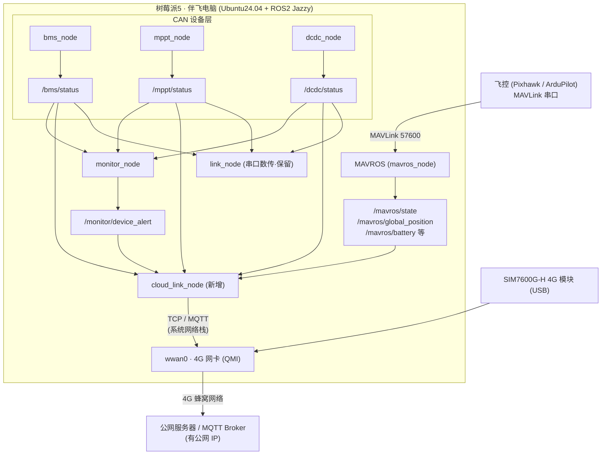
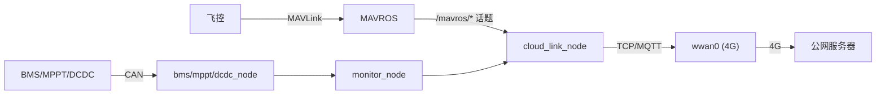

# 飞控 MAVLink + 机载设备状态经 4G 上云 · ROS2 节点拓扑

## 一、节点拓扑图（Mermaid）

```mermaid
flowchart TB
    subgraph PI["树莓派5 · 伴飞电脑 (Ubuntu24.04 + ROS2 Jazzy)"]
        direction TB
        subgraph CAN["CAN 设备层"]
            BMS["bms_node"] --> BMST["/bms/status"]
            MPPT["mppt_node"] --> MPPTT["/mppt/status"]
            DCDC["dcdc_node"] --> DCDCT["/dcdc/status"]
        end
        MON["monitor_node"]
        BMST --> MON
        MPPTT --> MON
        DCDCT --> MON
        MON --> ALERT["/monitor/device_alert"]

        CLOUD["cloud_link_node (新增)"]
        ALERT --> CLOUD
        BMST --> CLOUD
        MPPTT --> CLOUD
        DCDCT --> CLOUD

        LINK["link_node (串口数传·保留)"]
        BMST --> LINK
        MPPTT --> LINK
        DCDCT --> LINK

        MAVROS["MAVROS (mavros_node)"]
        MAVROS --> MAVTOPIC["/mavros/state<br/>/mavros/global_position<br/>/mavros/battery 等"]
        MAVTOPIC --> CLOUD

        WWAN["wwan0 · 4G 网卡 (QMI)"]
        CLOUD -->|"TCP / MQTT<br/>(系统网络栈)"| WWAN
    end

    FC["飞控 (Pixhawk / ArduPilot)<br/>MAVLink 串口"] -->|"MAVLink 57600"| MAVROS

    SUB["SIM7600G-H 4G 模块 (USB)"] --> WWAN

    WWAN -->|"4G 蜂窝网络"| CLOUD_SRV["公网服务器 / MQTT Broker<br/>(有公网 IP)"]
```

## 二、数据流

```mermaid
flowchart LR
    DEV["BMS/MPPT/DCDC"] -->|"CAN"| N1["bms/mppt/dcdc_node"]
    N1 --> MON2["monitor_node"]
    FC2["飞控"] -->|"MAVLink"| MAV["MAVROS"]
    MAV -->|"/mavros/* 话题"| CL2["cloud_link_node"]
    MON2 --> CL2
    CL2 -->|"TCP/MQTT"| W2["wwan0 (4G)"]
    W2 -->|"4G"| SRV2["公网服务器"]
```
